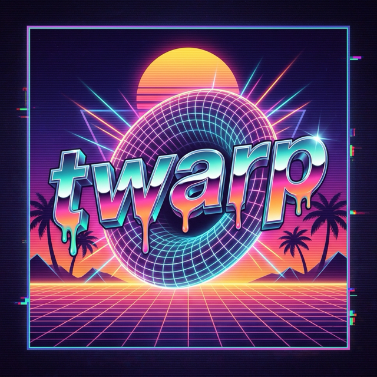

<p align="center">
  
</p>

<h1 align="center">twarp</h1>

<p align="center">
  A personal, unofficial fork of the open-source <a href="https://github.com/warpdotdev/warp">Warp</a> terminal —<br/>
  the built-in AI removed, your own CLI agent (Claude Code) wired in as a first-class pane instead.
</p>

> [!IMPORTANT]
> **twarp is an independent community fork. It is not affiliated with, endorsed by, or supported by Warp (warp.dev).**
> "Warp" is a trademark of its respective owner; twarp uses the name only to describe its origin as a fork.
> Please **do not report twarp bugs to the upstream Warp repository** or ask the Warp team for help with this fork — file issues [here](https://github.com/timomak/twarp/issues) instead. For the official product, go to [warp.dev](https://www.warp.dev).

## What is twarp?

Warp open-sourced its client in April 2026. twarp forks that codebase with a different opinion: the terminal itself shouldn't ship an AI — but it should be a great *host* for the agent you already run. So twarp removes Warp's built-in agentic mode, cloud-agent surfaces, and LLM-backed suggestions, and instead builds a native panel around the local `claude` CLI running on your own subscription. No LLM client in the app, no AI billing, no cloud sync of your conversations.

It's a personal side project, developed largely by AI agents against written specs, and it's macOS-first. Use at your own risk.

## What's different from Warp

**Removed**
- All built-in AI: agent mode, cloud agents, inline AI suggestions, AI command palette, and the telemetry that existed only to support them.

**Added**
- **Claude Code pane** — type `claude` and it opens as a rendered main-pane chat (streaming output, tool cards, plan rendering, permission prompts, session resume after restart), with a toggle back to the raw CLI. Runs your local `claude` binary; twarp is just the UI.
- **Built-in browser pane** — a WKWebView pane whose live DOM, console, and network are exposed to your Claude session over MCP, so the agent can debug the same tab you're looking at.
- **Computer-control overlay** — lets a Claude session see and drive the Mac (screenshot → action loop), with an on-screen indicator while capture is live.
- **VS Code-style Open Changes panel** — working/staged diffs, hunk-level stage/unstage, commit and push without leaving the terminal.
- **macOS-style UI pass** — Chrome-style tabs with drag between windows, macOS-style sidebar, theme-following panels.
- **Quality-of-life** — tab color shortcuts, tab rename shortcut, custom command shortcuts (bind a keystroke to "open a tab, type this, press enter…"), markdown files rendered by default.

**In progress** — an IDE pivot (file editor with go-to-definition via the existing LSP infrastructure, git blame, project search & replace) and a multi-provider agent settings page. Current status always lives in [`roadmap/ROADMAP.md`](roadmap/ROADMAP.md).

## Building from source

macOS is the supported platform. There are no prebuilt releases — you build it yourself:

```bash
./script/bootstrap              # platform setup
./script/run                    # build and run (debug)
./script/run --release --install  # build TwarpOss.app and install it
./script/presubmit              # fmt, clippy, tests
```

The bundle is `TwarpOss.app` with its own bundle ID, so it installs alongside official Warp without touching it. See [TWARP.md](TWARP.md) for the full engineering guide.

## Relationship to upstream

- twarp tracks `warpdotdev/warp` by **selective cherry-pick**, not bulk merges — perf, rendering, and fixes come across; AI-related commits are skipped.
- Forked from `warpdotdev/warp@d0f045c0` (2026-04-28).
- twarp does not use Warp's brand assets, connect to Warp's cloud services for AI features, or misrepresent itself as Warp. The app is branded twarp/TwarpOss throughout.
- If something here would be useful upstream, it belongs there as a proper contribution through [Warp's contribution process](https://github.com/warpdotdev/warp/blob/main/CONTRIBUTING.md) — not as pressure on this fork's maintainer to ship it.

## License

twarp inherits Warp's licensing unchanged: the UI framework crates (`twarpui_core`, `twarpui` — Warp's `warpui`) are [MIT](LICENSE-MIT); everything else is [AGPL v3](LICENSE-AGPL). The complete corresponding source for every twarp build is this repository.

## Acknowledgements

twarp exists because the Warp team built an excellent terminal and open-sourced it. All credit for the foundation — the Rust codebase, the custom Metal UI framework, the terminal emulation — goes to them. Among the many open-source projects Warp builds on: [Tokio](https://github.com/tokio-rs/tokio), [Alacritty](https://github.com/alacritty/alacritty), [NuShell](https://github.com/nushell/nushell), [Hyper](https://github.com/hyperium/hyper), and [Smol](https://github.com/smol-rs/smol).
