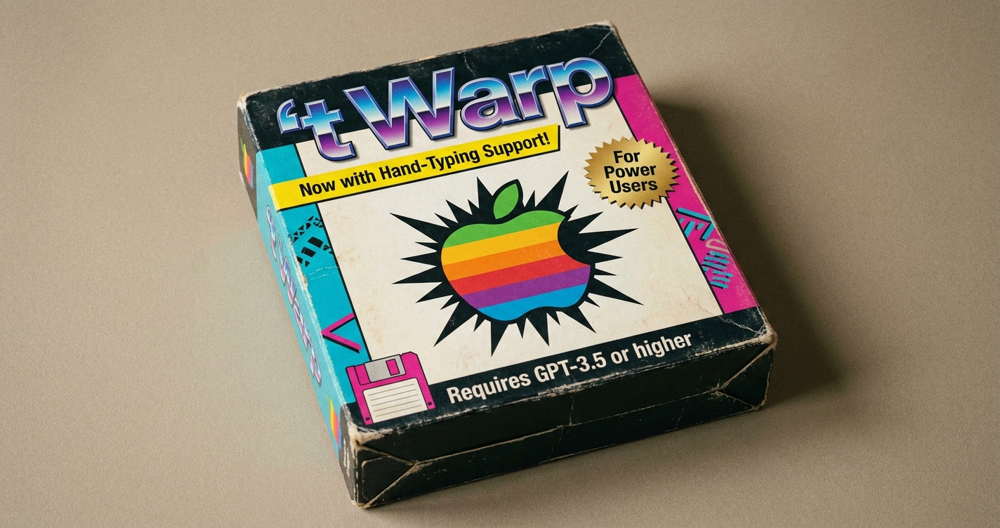

<p align="center">
  
</p>

<h1 align="center">twarp</h1>

<p align="center"><b>The terminal-first IDE. Built in Rust. GPU-rendered. Fast AF.</b></p>

<p align="center">
  Your agents live in tabs. Your tabs are isolated worlds. Drag one out and it's a window.<br/>
  No Electron. No web views pretending to be an app. One Metal drawable, all the way down.
</p>

> [!IMPORTANT]
> **twarp is an independent community fork of the open-source [Warp](https://github.com/warpdotdev/warp) terminal. It is not affiliated with, endorsed by, or supported by Warp (warp.dev).**
> "Warp" is a trademark of its respective owner; twarp uses the name only to describe its origin as a fork.
> **Do not report twarp bugs upstream** — file issues [here](https://github.com/timomak/twarp/issues). For the official product, go to [warp.dev](https://www.warp.dev).

---

## The pitch

Every IDE bolted an AI into a sidebar. twarp did the opposite: it took the fastest terminal codebase ever open-sourced, **ripped the built-in AI out by the roots**, and rebuilt the whole app around the agent *you* already pay for — the `claude` CLI, running locally, on your subscription.

Type `claude` in any tab. It doesn't scroll by as text — it opens as a **full native chat pane**: streaming responses, tool cards, diffs, plan rendering, permission prompts, session resume after a crash. The terminal is the IDE. The agent is the workflow. And the whole thing renders like a video game because it *is* rendered like a video game.

## Why twarp over cmux / Zed / VS Code?

**🧊 Tab isolation is the whole game.** Every tab is a sealed world: its own shell, its own working directory, its own Claude session, its own color. Red tab = prod. Green tab = local. Purple tab = the agent refactoring a worktree while you work in the next tab over. Run **multiple Claude sessions side by side** — one per tab, one per pane, zero crosstalk. This is what multi-agent work actually looks like when the UI was built for it instead of retrofitted.

**🪟 Drag a tab out — it's a window.** Chrome-style tabs, for real: grab one, tear it off, drop it on your other monitor. Drag it back into another window's tab strip. Your agent session, your shell, your scrollback — all of it moves with the tab. Try that in a terminal multiplexer.

**🦀 Rust + Metal, no Electron tax.** VS Code is a browser wearing a trench coat. cmux is web tech in a native frame. twarp is a Cargo workspace of 60+ crates drawing every pixel through its own GPU UI framework — text rendering, scrolling, and input latency in the same class as Zed, except the *terminal* is the first-class citizen, not a panel under the editor.

**⌨️ Terminal-first, not terminal-included.** Zed and VS Code are editors that ship a terminal in the basement. twarp inverts it: you live in the shell, and the IDE surfaces come to *you* — a VS Code-style **Open Changes panel** (stage hunks, commit, push without leaving the terminal), markdown rendered in place, and a file editor with LSP go-to-definition rolling out now.

**🕶️ Your agent can see what you see.** The built-in browser pane exposes its **live DOM, console, and network to your Claude session over MCP** — the agent debugs the exact tab you're looking at, not a headless clone. And the computer-control overlay lets a session drive the whole Mac in a screenshot → action loop, with a glow border so you always know when it's live.

**🔒 No middleman on your AI.** No LLM client in the app. No AI billing. No cloud sync of your conversations. twarp renders your local `claude` process — your keys, your subscription, your machine. The fork's first act was deleting every line that phoned an LLM from inside the terminal.

## The arsenal

- 🤖 **Claude Code pane** — native streaming chat UI over the local `claude` CLI, with raw-CLI toggle, MCP server viewer, and post-crash session resume
- 🌐 **Agent-debuggable browser** — WKWebView pane wired to your Claude session via MCP
- 🖱️ **Computer control** — Claude sees and drives the Mac, with visible capture indicator
- 🎨 **Tab colors on keystrokes** — `⌘⌥1..8`, instant visual context isolation
- 🔀 **Chrome-style tab tear-off** — tabs → windows → tabs, drag both ways
- 📝 **Open Changes panel** — VS Code-grade git staging, diffs, commit & push, in-terminal
- ⚡ **Custom command shortcuts** — bind one keystroke to "new tab, type `claude`, enter, run my slash command"
- 📄 **Markdown rendered by default** — `.md` files display, not dump
- 🍎 **macOS-native feel** — macOS-style sidebar, theme-following panels, all emulated in the GPU framework

**Shipping next:** the full IDE pivot — file editor with LSP go-to-definition, git blame, project-wide search & replace, and a multi-provider agent settings page. Live status: [`roadmap/ROADMAP.md`](roadmap/ROADMAP.md).

## Install or build

Download the latest signed macOS build from [GitHub Releases](https://github.com/timomak/twarp/releases/latest), or build it from source:

```bash
./script/bootstrap                # platform setup
./script/run                      # build and run (debug)
./script/run --release --install  # build Twarp.app → /Applications
./script/presubmit                # fmt, clippy, tests
```

Installs as `Twarp.app` with its own bundle ID — lives peacefully next to official Warp. Full engineering guide in [TWARP.md](TWARP.md).

## Relationship to upstream

- Tracks `warpdotdev/warp` by **selective cherry-pick** — perf, rendering, and fixes come across; AI commits are skipped. Forked from `warpdotdev/warp@d0f045c0` (2026-04-28).
- twarp doesn't use Warp's brand assets, doesn't touch Warp's cloud AI services, and doesn't misrepresent itself as Warp.
- Want a twarp feature in Warp? Take it upstream through [their contribution process](https://github.com/warpdotdev/warp/blob/main/CONTRIBUTING.md).

## License

Inherited from Warp unchanged: the UI framework crates (`twarpui_core`, `twarpui`) are [MIT](LICENSE-MIT); everything else is [AGPL v3](LICENSE-AGPL). The complete corresponding source for every twarp build is this repository.

## Standing on giants

twarp exists because the Warp team built an outrageously good terminal and open-sourced it — the Rust codebase, the custom Metal UI framework, the terminal emulation are theirs. Shout-outs down the stack: [Tokio](https://github.com/tokio-rs/tokio), [Alacritty](https://github.com/alacritty/alacritty), [NuShell](https://github.com/nushell/nushell), [Hyper](https://github.com/hyperium/hyper), [Smol](https://github.com/smol-rs/smol).
