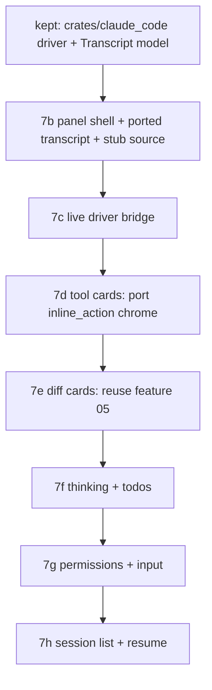

# Claude Code panel — TECH

Companion to [PRODUCT.md](PRODUCT.md). Section numbers in the Testing table refer to PRODUCT.md invariants. Sub-phase **7a** (audit + tech spec) resolved the "can the rendering layer be detangled from the service layer?" gate. This document was **re-spec'd after PR #67** ([respec context below](#proposed-changes)): the gate's verdict (port-and-adapt) stands, but #67 ignored it and rebuilt the panel from GPUI primitives, so the "Proposed changes" section is rewritten to be a per-file porting plan an implementer cannot misread. Impl restarts at **7b**.

## Context

twarp wants the *rendering* layer of Warp's Agent Mode back, driven by the local `claude` CLI, with **none** of the service layer feature 02 deleted. Two halves: (a) a UI that renders a conversation in Warp's Agent-Mode shape, (b) a subprocess driver that runs `claude --output-format stream-json` and translates its events into that UI's model.

### What feature 02 deleted, and what survives

Feature 02 (PRs #6–#18) removed the AI service and the conversation renderer together. The renderer is recoverable from commit **`fea2f7ea`** (`[twarp 02] specs: ai-removal (#4)`) — the feature-02 *spec* commit, which predates every code-deletion PR, so the full renderer is intact there. Verified: `git show fea2f7ea:app/src/ai_assistant/panel.rs`, `…/ai/blocklist/inline_action/code_diff_view.rs`, and `…/ai/blocklist/block/view_impl/todos.rs` all return content; all three are absent on master.

**Two distinct surfaces lived in `fea2f7ea` — do not conflate them (the re-spec investigation's headline finding):**

- **`app/src/ai_assistant/`** is the older **"Warp AI" Q&A panel**: a right-side resizable modal that renders a *question→answer* transcript (markdown prose + fenced code blocks), driven by `Requests`/`AIClient`/`ServerApi`/`InputSuggestions`. It has **no** tool cards, thinking blocks, todos, or diff cards.
- **`app/src/ai/blocklist/`** is **Agent Mode**: the rich agentic surface (tool-call cards, diff cards, collapsible thinking, todo list) that `warp.dev/agents/claude-code` actually shows. It renders an `AIBlock` whose data is the `AIAgentOutput` / `AIAgentOutputMessageType` stream, and is deeply coupled to `AIBlockModel`, `BlocklistAIActionModel`, `BlocklistAIHistoryModel`, `AIConversation`, and `TerminalModel`.

These two were **never composed together**. The table below maps each PRODUCT surface to the *real* file(s) that render it and the per-file porting verdict from the investigation. (The earlier draft of this table implied a single clean lineage from `ai_assistant/*` + `ai/blocklist/*`; that was misleading and is corrected here.)

| PRODUCT surface | Source @ `fea2f7ea` | Lines | Verdict (see [decision matrix](#per-file-decision-matrix)) |
|---|---|---|---|
| Markdown assistant text (§18) | `markdown_parser::parse_markdown` + `warpui::elements::FormattedTextElement` | — | **Reuse on master** (AI-agnostic; feature 03's live stack) |
| User/assistant transcript (§16–§18) | `ai_assistant/transcript.rs` `render_message`, `ai_assistant/utils.rs` markdown splitter | 979 / 479 | **Port + reparent** onto `TranscriptItem`; strip `Requests`/`TranscriptAction` |
| Panel shell + dispatch/focus | `ai_assistant/panel.rs` | 1191 | **Reference pattern only** (Stack+overlay header, `on_left_mouse_down` focus-grab, per-subview `TypedActionView`); not a line-port — coupled to `Requests`/`ServerApi`/`ResizableData` |
| Card chrome (header, body, icons) | `ai/blocklist/inline_action/{inline_action_header,requested_action,requested_script,inline_action_icons}.rs` | 406/608/363/42 | **Port (clean leaves)** — zero `crate::ai::` service coupling; take strings + `Rc<dyn Fn>` callbacks |
| Per-tool / command / MCP card | `ai/blocklist/inline_action/requested_command.rs` | 1646 | **Rewrite leaf** — `View` bound to `BlocklistAIActionModel`/`TerminalModel`/`CodeEditorView`; reuse only the chrome above |
| Diff card (§30–§33) | `ai/blocklist/inline_action/code_diff_view.rs` | 3190 | **Do NOT port; reuse feature 05** — interactive accept/reject editor, heavy AI coupling, delegates real diffing to `crate::code::inline_diff` |
| Assistant text + thinking leaves | `ai/blocklist/block/view_impl/{output,common}.rs` | 3777/3565 | **Extract helpers, don't port dispatcher** — `output::render` is a 700-line `match` over `AIAgentOutputMessageType`; reuse only `FormattedTextElement` + collapsible/`format_elapsed_seconds` helpers |
| Todo list (§37–§38) | `ai/blocklist/block/view_impl/todos.rs` | 255 | **Port leaf + bridge** — swap `AIConversation`/`AIAgentTodo`/`TodoStatus`→ our `TodoItem`/`TodoStatus`; reuse header+icons |
| User query row | `ai/blocklist/block/view_impl/query.rs` | 176 | **Optional small leaf** — flat Props, no model; or fold into the ported transcript |
| Block header (cwd/overflow) | `ai/blocklist/block/view_impl/header.rs` | 262 | **Do NOT port** — Agent-block chrome tied to `TerminalAction`/`DirectoryContext`; our header is net-new |

**Detangle gate — resolved (unchanged): port-and-adapt, evaluated per leaf.** The investigation refined *where* the reusable code is and *how much* coupling each leaf carries (the matrix above and [below](#per-file-decision-matrix)). The key correction PR #67 needed: the genuinely reusable rendering primitives are the **`inline_action` card chrome** (`HeaderConfig`/`RenderableAction`/status icons — already AI-agnostic) plus the **shared markdown stack** (`parse_markdown` → `FormattedTextElement`) plus **feature 05's read-only diff renderer** — *not* a `git restore` of any one panel file, and *not* a rebuild from `Flex`/`Container`/`Link` primitives. Per-leaf rule stands: if porting a leaf drags in more `crate::ai::` coupling than rewriting it costs, rewrite it against the same visual contract.

### Surviving scaffolding (reuse / avoid)

PR #67 already built all of this scaffolding correctly; it stays (see [What survives from PR #67](#what-survives-from-pr-67-keep-and-what-is-discarded)).

- **Left-panel registration.** `ToolPanelView` enum at `app/src/workspace/view/left_panel.rs:193`; `LeftPanelDisplayedTab` at `app/src/app_state.rs:889` with the `From<ToolPanelView>` impl at `:904`; toolbelt button config in `left_panel.rs` (the `ConversationListView` arm at `:977` is the shape to copy); render/focus dispatch in `left_panel.rs`; availability list `compute_left_panel_views` at `app/src/workspace/view.rs:18083`.
- **Dead `ConversationListView` stub.** Present across `left_panel.rs` and `app_state.rs`, kept only so legacy call-sites compile. **Do not repurpose it.** Add a clean `ClaudeCode` variant instead (PR #67 did this correctly).
- **Keybinding hook.** `CustomAction` enum at `app/src/util/bindings.rs:32`; `custom_tag_to_keystroke` at `:266`. **Per the feature-06 lesson (and twarp keybinding memory): assign the default chord in `custom_tag_to_keystroke`, never via `EditableBinding::with_key_binding`** — the latter clobbers `Trigger::Custom` and panics the mac menu at startup. ⌘⌥K (`cmdorctrl-alt-k`) is conflict-free and was shipped in #67 via this mechanism.
- **Subprocess precedent.** `app/src/util/git.rs:26` (`command::r#async::Command`, `Stdio::piped()`, `kill_on_drop(true)`) and the **stdin-capable** variant at `:91`. (The `claude_code` driver crate #67 built already follows this — it is kept.)
- **Streaming scroll.** `UniformList` + `UniformListState` as used by Global Search (`app/src/workspace/view/global_search/view.rs:314`, init `:709`). Bottom-stick auto-scroll (PRODUCT §22) layers on top. **#67 used a static `Flex::column` instead — the port must use `UniformList`.**
- **Diff rendering.** Feature 05's renderer — `render_file_content` (`app/src/code_review/code_review_view.rs:5984`), `render_diff_stats` (`:5038`) and the `crate::code::inline_diff::InlineDiffView` primitive (`app/src/code/inline_diff.rs`) — already render a unified diff with themed +/- tinting. Reuse for diff cards (PRODUCT §30–§33).
- **Markdown.** The shared stack — `markdown_parser::parse_markdown(text) -> FormattedText` then `warpui::elements::FormattedTextElement` — is AI-agnostic and used all over master (`global_search/view.rs`, `code/local_code_editor.rs`, `notebooks/`, settings, banners). This is feature 03's path; call it directly for §18.
- **Left-panel dispatch precedent.** `GlobalSearchView` (`app/src/workspace/view/global_search/view.rs:329`) is a left-panel tab that is itself a `TypedActionView<Action = GlobalSearchAction>` and dispatches its own actions via `ctx.dispatch_typed_action(GlobalSearchAction::…)` — proving in-panel typed dispatch works for a left-panel tab without any `WorkspaceAction` forwarder. The ported panel follows this (see [the panel](#the-panel-appsrcclaude_code_panel--port-shaped)).

## Proposed changes

### Postmortem: why PR #67 was abandoned (read this first)

PR #67 shipped a panel at `app/src/claude_code_panel/mod.rs` rendered **entirely from GPUI primitives** — `Flex::column()`, `Container::new(...).with_background_color(...)`, `appearance.ui_builder().span(...)` / `.link(...)`. **Zero lines came from the deleted Agent Mode rendering layer.** That produced a panel that looks nothing like Warp's Agent Mode: plain-text "tool cards" with no per-tool affordances; a `similar`-generated unified diff rendered as untinted plain spans (no +/- tinting, no hunk headers — none of feature 05's treatment, despite §33); a static `Flex::column` with no `UniformList` and no bottom-stick auto-scroll; assistant text in plain text instead of feature 03's markdown (§18); and a dispatch workaround — in-panel link clicks dispatched `WorkspaceAction::ClaudeCodePanel(ClaudeCodePanelAction)` and forwarded through `Workspace::handle_action` because direct `dispatch_typed_action(ClaudeCodePanelAction::…)` "dropped silently when focus wasn't on the panel." That is symptom-treatment, not the fix (see [dispatch/focus](#the-panel-appsrcclaude_code_panel--port-shaped)). The "small follow-ups" #67 accumulated (placeholder text, scrolling, markdown, real tool cards, diff styling, focus) are all things the ported UI already handles.

> **Implementer stop-sign:** If you find yourself writing `Flex::column().with_child(appearance.ui_builder().link(...))` for anything more structured than a one-line status pill, **stop** — `git show fea2f7ea:<the relevant file>` (from the [decision matrix](#per-file-decision-matrix)) is your starting point. Start at the leaf renderer, decide port / reparent / rewrite per the matrix, and reuse the shared markdown + feature-05 diff stacks. Do not rebuild a card, a diff, or a thinking block from primitives.

### What survives from PR #67 (keep) and what is discarded

**Keep — `crates/claude_code/` (the driver crate, 19 passing unit tests):**

- `lib.rs` — the `Transcript` / `TranscriptEvent` / `TranscriptItem` contract (headless, unit-tested). This is the model the ported UI renders against and the bridge's target.
- `driver.rs` — subprocess spawn (`claude -p --input-format stream-json --output-format stream-json --verbose`), defensive line-by-line JSONL parser (`futures::stream::unfold` + `BufReader::lines`), SIGINT `interrupt`, stdin writer `send_user_message`, `PermissionMode`/`SpawnOptions`.
- `sessions.rs` — encoded-cwd + `list_sessions` + best-effort title parser for the resume list.

The driver crate is the **only** thing in PR #67 that survives into the next attempt. It is correct, headless, and decoupled from the UI mistake.

**Keep with edits — the registration scaffolding** (see [Surviving scaffolding](#surviving-scaffolding-reuse--avoid)): `ToolPanelView::ClaudeCode`, `LeftPanelDisplayedTab::ClaudeCode` + `From` arm, the toolbelt button, the ⌘⌥K binding via `custom_tag_to_keystroke`, the `compute_left_panel_views` push, the `LeftPanelAction::ClaudeCode` focus-on-activate. These touchpoints are correct; what becomes the ported UI is the *body* of the panel view. The `claude_code_view()` accessor on `LeftPanelView` stays (used the same way; the ported panel handles its own dispatch).

**Discard:**

- `app/src/claude_code_panel/mod.rs` — the entire primitive render, the `ClaudeCodePanelAction` enum's *dispatch-routing*, and the `render_*` helpers built from `Flex`/`Container`/`Link`. (The pure data helpers `tool_input_summary`, `diff_for_tool`/`unified_diff`, `relative_time`, `encode`/session loading are fine to **keep as bridge code** — they translate `TranscriptItem` → render inputs and carry no UI mistake.)
- `WorkspaceAction::ClaudeCodePanel(ClaudeCodePanelAction)` in `app/src/workspace/action.rs` and its handler arm in `app/src/workspace/view.rs` — the dispatch workaround. The ported panel dispatches its own action like `GlobalSearchView`.

### Recovering the deleted UI — `git show` per file

The investigation read each file from a snapshot; an implementer recovers them the same way (do **not** `git restore` — that re-introduces service coupling):

```bash
# Panel-shell + transcript reference (Warp AI Q&A panel)
git show fea2f7ea:app/src/ai_assistant/transcript.rs        # render_message: markdown prose + code blocks
git show fea2f7ea:app/src/ai_assistant/utils.rs             # markdown_segments_from_text + MarkdownSegment
git show fea2f7ea:app/src/ai_assistant/panel.rs             # Stack+overlay header, on_left_mouse_down focus-grab (pattern only)

# Card chrome — the clean, AI-agnostic leaves (PORT THESE)
git show fea2f7ea:app/src/ai/blocklist/inline_action/inline_action_icons.rs   # status icons (pure data)
git show fea2f7ea:app/src/ai/blocklist/inline_action/inline_action_header.rs  # HeaderConfig + InteractionMode
git show fea2f7ea:app/src/ai/blocklist/inline_action/requested_action.rs      # RenderableAction builder
git show fea2f7ea:app/src/ai/blocklist/inline_action/requested_script.rs      # collapsible script card (optional)

# Leaves to mine for helpers / bridge, NOT port wholesale
git show fea2f7ea:app/src/ai/blocklist/block/view_impl/todos.rs    # collapsible "Tasks" list (port + bridge)
git show fea2f7ea:app/src/ai/blocklist/block/view_impl/common.rs   # render_rich_text_output_text_section, format_elapsed_seconds, collapsible helpers
git show fea2f7ea:app/src/ai/blocklist/block/view_impl/query.rs    # user-query row (optional small leaf)

# DO NOT PORT (rewrite / reuse feature 05) — read only to confirm the coupling
git show fea2f7ea:app/src/ai/blocklist/inline_action/code_diff_view.rs   # interactive accept/reject editor diff (3190 lines)
git show fea2f7ea:app/src/ai/blocklist/inline_action/requested_command.rs # stateful View bound to BlocklistAIActionModel
git show fea2f7ea:app/src/ai/blocklist/block/view_impl/output.rs          # 700-line match over AIAgentOutputMessageType
```

### Per-file decision matrix

`port`/`reparent` = bring back the GPUI element code, swap the model it reads. `rewrite leaf` = the file's *visual* job is reproduced against the same theme/glyph contract, but the source is too service-coupled to port. `reuse` = the live code on master already does this. `extract` = lift specific helper fns, leave the dispatcher.

```
component (fea2f7ea path)                          action            coupling notes (how the AI deps are used)
──────────────────────────────────────────────────────────────────────────────────────────────────────────────
ai_assistant/transcript.rs::render_message         port + reparent   reads requests_model.transcript() → swap to
                                                                      Transcript::items(); dispatches TranscriptAction
                                                                      (its own TypedActionView) → keep that shape, retarget
                                                                      to our items. Renders MarkdownSegment via
                                                                      FormattedTextElement + special code-block boxes.
ai_assistant/utils.rs (markdown split)             port              markdown_segments_from_text /
                                                                      translate_formatted_text_into_markdown_segments /
                                                                      MarkdownSegment — AI-agnostic. Drop
                                                                      render_prepared_response_button (uses
                                                                      AIAssistantAction) + render_request_limit_info (Requests).
ai_assistant/panel.rs                              reference only    coupled to Requests/AIClient/ServerApi/
                                                                      InputSuggestions/ActiveSession/ResizableData. Port the
                                                                      *shape*: Stack with overlay header, zero-state vs
                                                                      transcript vs editor layout, and the
                                                                      EventHandler::on_left_mouse_down→focus_self trick that
                                                                      makes dispatched actions land. No data plumbing ports.
inline_action/inline_action_icons.rs               port (pure data)  ZERO crate::ai:: coupling. green_check/red_x/cancelled/
                                                                      reverted/icon_size. Maps to ToolStatus directly.
inline_action/inline_action_header.rs              port (leaf)       ZERO crate::ai:: service coupling. HeaderConfig{title,
                                                                      icon, badge, markdown} + InteractionMode{ActionButtons,
                                                                      ManuallyExpandable, RightClickable} with Rc<dyn Fn>
                                                                      callbacks. Deps: view_components::compactible_action_button
                                                                      (survives on master).
inline_action/requested_action.rs                  port (leaf)       ZERO crate::ai:: service coupling. RenderableAction
                                                                      builder (icon+body+button+header+footer). Takes &str /
                                                                      FormattedTextElement / Box<dyn Element> + closures.
                                                                      Depends on WithContentItemSpacing (co-port, see stub layer).
inline_action/requested_script.rs                  port (leaf, opt)  ZERO crate::ai:: coupling. Collapsible script body +
                                                                      Run/Cancel. Use if rendering command/script bodies.
inline_action/requested_command.rs                 rewrite leaf      DEEP coupling: View holding BlocklistAIActionModel +
                                                                      TerminalModel + CodeEditorView; subscribes to
                                                                      BlocklistAIActionEvent; reads execution/permission state;
                                                                      lets user edit+run the command. Our cards are read-only
                                                                      renderings of TranscriptItem::Tool → rebuild from the
                                                                      chrome leaves above. (#67's tool_input_summary is fine
                                                                      to keep as the per-tool summary bridge.)
inline_action/code_diff_view.rs                    do NOT port       3190 lines: interactive accept/reject/edit; new() needs
                                                  → reuse feat. 05   AIBlockModel + BlocklistAIActionModel + AIIdentifiers +
                                                                      AIAgentActionId; telemetry; history-model revert;
                                                                      skills/MCP header buttons; FileEdit→FileDiff restore.
                                                                      The REAL diffing is delegated to
                                                                      crate::code::inline_diff::InlineDiffView (read-only mode
                                                                      available) fed an ai::diff_validation::DiffType. PRODUCT
                                                                      §33 is read-only → reuse feature 05's renderer / the
                                                                      InlineDiffView primitive; do not adopt this file's chrome.
block/view_impl/output.rs                          extract helpers   700-line match over AIAgentOutputMessageType +
                                                                      AIAgentActionType, bound to AIBlockModel/
                                                                      BlocklistAIActionModel. Do NOT port the dispatcher. The
                                                                      Reasoning arm + render_collapsible_text_block_section +
                                                                      format_elapsed_seconds are the thinking-card reference.
block/view_impl/common.rs                          extract helpers   render_rich_text_output_text_section(Arc<FormattedText>)
                                                                      is the AI-agnostic text leaf; format_elapsed_seconds;
                                                                      collapsible/scrollable helpers; render_user_avatar.
                                                                      NB render_text_sections consumes AIAgentTextSection —
                                                                      reuse the inner rich-text fn, fed our own parse_markdown.
block/view_impl/todos.rs                           port leaf + bridge collapsible "Tasks" header (HeaderConfig +
                                                                      InteractionMode::ManuallyExpandable) + icon+strikethrough
                                                                      rows. Coupling: AIConversation.todo_status / AIAgentTodo /
                                                                      TodoStatus / MessageId + AIBlockAction::ToggleTodoListExpanded.
                                                                      Bridge to TranscriptItem::Todos(Vec<TodoItem>) + our
                                                                      TodoStatus (already mirror these) + our toggle action.
block/view_impl/query.rs                           port leaf (opt)   flat Props, no model handle; user-query row via
                                                                      render_query_text. Maps to TranscriptItem::User. Or fold
                                                                      into the ported transcript renderer.
block/view_impl/header.rs                          do NOT port       attached-context chip / cwd / overflow menu tied to
                                                                      TerminalAction + DirectoryContext + IDs. Our panel header
                                                                      (status pill + permission-mode + end-session) is net-new.
markdown_parser + FormattedTextElement (master)    reuse             AI-agnostic; feature 03's live stack; widely used on master.
code_review_view.rs render_file_content /          reuse             feature 05's themed read-only diff renderer + the
  crate::code::inline_diff::InlineDiffView                            lower-level InlineDiffView primitive.
```

### The stub / co-port layer

The clean card leaves reference almost nothing under `crate::ai::` *service* code — their `crate::ai::` imports are sibling presentational helpers that co-port with them. The genuinely missing dependencies (deleted with feature 02, not present on master) are small and concrete:

- **`WithContentItemSpacing`** — a tiny extension trait (`.with_content_item_spacing()` / `.with_agent_output_item_spacing()`) that lived in `ai/blocklist/block/view_impl`; `requested_action.rs`, `requested_script.rs`, and `todos.rs` call it. **Co-port it** into the new `claude_code_panel` module (a few lines), or inline equivalent margins. It does **not** need the `ai` model.
- Confirm-on-master (present today; verify at impl time since they could move under feature 08's rebrand): `crate::view_components::{action_button, compactible_action_button, compactible_split_action_button}`, `crate::ui_components::{blended_colors, icons::Icon}`, `warp_core::ui::Icon`. All resolve on master now (`global_search/view.rs` imports the same `Icon`).

There is **no large "stub the deleted `crate::ai::*` imports" layer** — the original spec over-anticipated this. Most coupling is either (a) a sibling presentational helper that co-ports, (b) real data we *bridge* (todos), or (c) a dispatcher we *rewrite* (command/diff/output). Keep the stub layer to the handful of items above and resist re-creating `crate::ai` types.

### The bridge: `TranscriptItem` → ported leaves

We already own the thin model (`claude_code::Transcript` / `TranscriptItem`, shipped & tested in #67). The "bridge" is the panel's per-item render dispatch — a single `match` over `TranscriptItem` that feeds each ported leaf the data it expects:

```
TranscriptItem::User(text)              → ported user row (transcript.rs::render_user_prompt / query.rs)
TranscriptItem::Assistant{text,done}    → parse_markdown(text) → markdown-segment renderer
                                          (transcript.rs::render_message); a "…" cue while !done (§17)
TranscriptItem::Thinking{text,duration} → collapsible card (output.rs Reasoning + common.rs
                                          render_collapsible_text_block_section + format_elapsed_seconds) (§34)
TranscriptItem::Tool{name,input,status, → RenderableAction card: icon (name→icon map + status icon),
  output}                                 title = tool_input_summary(name,input) [kept from #67],
                                          body = output (collapsible >N lines); generic fallback for
                                          unmapped / mcp__* (§23–§29)
   …where name ∈ {Edit,MultiEdit,Write}  → diff card: synthesize unified diff from old_string/new_string/
                                          content [diff_for_tool kept from #67] → render READ-ONLY via
                                          feature 05 / InlineDiffView (§30–§33)
TranscriptItem::Todos(Vec<TodoItem>)    → ported todos.rs layout, TodoItem/TodoStatus bridged (§37–§38)
TranscriptItem::Permission{tool,input,  → permission card (informational now; Allow/Deny when the wire
  decision}                               protocol is reverse-engineered — §39/§42)
TranscriptItem::Notice(msg)             → themed notice row (interrupted / ended)
TranscriptItem::Error(msg)              → themed error card, verbatim + copyable (§55)
```

This dispatch lives in the panel view and renders into a `UniformList` (PRODUCT §21–§22 bottom-stick auto-scroll). Keeping the model→render mapping behind `TranscriptItem` (rather than threading raw `claude` JSON or the `AIAgentOutput` model into the view) is what keeps the leaves portable and view-testable against synthetic items.

### The driver-translation layer (`crates/claude_code`) — shipped in #67, kept

Unchanged from #67; this is correct and stays. Wire types mirror the stream-json schema (defensive: catch-alls, all non-essential fields `Option`):

```rust
// crates/claude_code/src/event.rs — what `claude` emits on stdout
enum ClaudeStreamEvent {
    System { subtype: SystemSubtype, session_id: Option<String>, /* init: model, tools, cwd, permission_mode */ .. },
    Assistant { message: ApiMessage, .. },   // content blocks: Text | Thinking | ToolUse
    User      { message: ApiMessage, .. },    // content blocks: ToolResult | Text
    StreamEvent { event: serde_json::Value, .. }, // partial deltas (--include-partial-messages)
    Result    { subtype: ResultSubtype, is_error: bool, result: Option<String>, total_cost_usd: Option<f64>, .. },
    #[serde(other)] Unknown,                  // PRODUCT §53: tolerate unknown types
}
```

The driver translates `ClaudeStreamEvent` → the twarp-native `TranscriptEvent` the UI consumes, so the UI never sees raw claude JSON:

```rust
enum TranscriptEvent {
    UserMessage(String),
    AssistantTextDelta { text: String },      // or whole-message if partials unavailable (§17)
    AssistantTextDone,
    Thinking { text: String, duration: Option<Duration> },   // §34
    ToolCall { id: String, name: String, input: serde_json::Value },   // §23
    ToolResult { id: String, output: ToolOutput, is_error: bool },     // §26
    Todos(Vec<TodoItem>),                      // from TodoWrite (§37)
    PermissionRequest { id: String, tool: String, input: serde_json::Value }, // §39 (see Risks)
    SessionInit { session_id: String, cwd: PathBuf },
    Ended { reason: EndReason },               // success | interrupted | error | exited (§52)
}
```

Subprocess: `command::r#async::Command::new("claude")` (resolved on `PATH`; absence → the unavailable state, PRODUCT §6) with `-p --input-format stream-json --output-format stream-json --verbose [--include-partial-messages] --model <cfg> [--resume <id>] [--permission-mode <mode>] [--allowedTools …]`, `current_dir(panel_cwd)`, all three pipes, `kill_on_drop(true)` (§15). A background task reads stdout line-by-line, parses each line independently (a bad line is dropped, not fatal — §53), and forwards `TranscriptEvent`s over a channel to the UI. User messages (§8/§16) and, if used, permission responses (§39) are written as JSONL to stdin. **`--verbose` is mandatory** with `stream-json` or only the final result is emitted; **`--bare` must not be used** (it skips OAuth/keychain and would break implicit Max-subscription auth).

### The panel (`app/src/claude_code_panel/`) — port-shaped

- **Registration (kept from #67).** `ToolPanelView::ClaudeCode`, `LeftPanelDisplayedTab::ClaudeCode` + `From` arm, the toolbelt button, the render arm, the `compute_left_panel_views` push, and the ⌘⌥K binding via `custom_tag_to_keystroke` all stay. Only the panel *body* changes.
- **Dispatch + focus (the #67 fix).** The panel is a `TypedActionView` whose in-panel `on_click`s dispatch its **own** action enum via `ctx.dispatch_typed_action(PanelAction::…)` — exactly as `GlobalSearchView` does for a left-panel tab. To guarantee the panel is the dispatch target when a transcript affordance is clicked, mirror `ai_assistant/panel.rs`: wrap the panel body in `EventHandler::on_left_mouse_down` that focuses the panel (the `LeftPanelAction::ClaudeCode` arm already focuses it on tab-activate; keep that). Where a sub-view is independently interactive (the message `EditorView`; a rewritten command card), make it its own `TypedActionView` and communicate upward via `ctx.emit` + `subscribe_to_view`, as `AIAssistantPanelView` does with its `Transcript`/`editor`/`InputSuggestions`. **Delete** the `WorkspaceAction::ClaudeCodePanel` forwarder and its `Workspace::handle_action` arm — they were the symptom-fix for skipping this.
- **Transcript model + view.** The panel owns a `claude_code::Transcript`; a `UniformList` renders its `items()` through the [bridge dispatch](#the-bridge-transcriptitem--ported-leaves) with bottom-stick auto-scroll (§22). The zero state (PRODUCT §5) renders when the transcript is empty; the unavailable state (§6) replaces everything when `claude` is off `PATH`.
- **Cards/diffs/thinking/todos.** Built from the ported `inline_action` chrome + the markdown stack + feature 05's diff renderer + the collapsible helpers, per the matrix and bridge above. No card, diff, or thinking block is built from bare `Flex`/`Container`/`Link`.

### Re-derived sub-phase plan (port-shaped)

The old 7b–7h split was organized by *what the panel does* (driver, tool cards, diffs, …). This plan is organized by *which leaf is brought back, what it's bridged to, and what stub it needs* — so each PR is a reviewable porting step, and 7b alone is visually testable end-to-end with no driver.

- **7b — Panel shell + ported transcript, stub event source.** Keep the registration scaffolding; replace #67's primitive body with the ported transcript renderer (`transcript.rs::render_message` + the markdown stack) inside a `UniformList`, rendering a `Transcript` populated by a **synthetic/stub event source** (a hardcoded sample of user/assistant/markdown items — no driver yet). Wire dispatch the `GlobalSearchView` way and delete the `WorkspaceAction::ClaudeCodePanel` forwarder. Zero state + unavailable state. **Acceptance: the sample transcript renders in Agent-Mode shape — markdown prose, code blocks, themed — and visually matches `warp.dev/agents/claude-code`** (PRODUCT smoke 1–5; §1–§7, §16–§20, §60). This is the gate that #67 never met.
- **7c — Live driver bridge.** Connect the kept `claude_code::driver` to the ported transcript via the bridge dispatch; remove the stub source. Streaming/Stop/lifecycle/teardown. PRODUCT §8–§22, §52–§57. (Driver crate already done; this is the wiring + the `apply_event` pump on the main thread.)
- **7d — Tool cards.** Port `inline_action_icons` + `inline_action_header` + `requested_action` (+ co-port `WithContentItemSpacing`); bridge `TranscriptItem::Tool` → `RenderableAction` cards with per-tool summary + generic fallback for unmapped/`mcp__*`. PRODUCT §23–§29.
- **7e — Diff cards.** Synthesize a unified diff (kept `diff_for_tool`) and render it **read-only via feature 05 / `InlineDiffView`** (not the `code_diff_view.rs` chrome, not plain spans). PRODUCT §30–§33.
- **7f — Thinking + todos.** Extract the collapsible-thinking helpers (`output.rs`/`common.rs`) for `TranscriptItem::Thinking`; port `todos.rs` bridged to `TodoItem`/`TodoStatus`. PRODUCT §34–§38.
- **7g — Permissions + input.** Permission-mode selector → `--permission-mode` (robust path first); message `EditorView`; interactive prompts gated behind the pinned-version check with §42 degradation. PRODUCT §39–§45.
- **7h — Session list + resume.** The kept `sessions.rs` reader; resume via `claude --resume <id>`; new-session; zero-state Resume list. PRODUCT §46–§51.

### Feature flag & rollout

PRODUCT/TECH originally gated the panel behind `FeatureFlag::ClaudeCodePanel`. **PR #67 removed that flag (`0ddeb37c "remove ClaudeCodePanel feature flag — panel is always on"`)** so the tab is unconditional in `compute_left_panel_views`. **Decision for the implementer:** either (a) restore a flag-gated push for dogfood-only rollout and `promote-feature` once the driver is proven against the pinned `claude` version, or (b) keep it always-on (acceptable for a personal fork where the owner is the only user). Record the choice in STATUS. Either way the panel must degrade cleanly when `claude` is absent (§6), so "always on" does not break a machine without Claude Code installed.

### Chord conflict-check (done)

⌘⌥K (`cmdorctrl-alt-k`) was conflict-checked and is unbound (`grep` for `cmd-alt-k`/`cmdorctrl-alt-k` finds no live action; no dead post-AI-removal binding claims it). Assigned in `custom_tag_to_keystroke` (not `with_key_binding`), launch-verified no startup panic in #67. Keep.

## Testing and validation

`crates/claude_code` is the unit-test workhorse (kept from #67, 19 tests); the panel relies on view tests + manual smoke (the PRODUCT smoke test is the acceptance gate per sub-phase). **The port-and-adapt acceptance gate, new in this re-spec: the rendered panel must be visually consistent with Warp's Agent Mode (cf. `warp.dev/agents/claude-code`) — themed cards, +/- tinted diffs, collapsible thinking, a real task list — not a primitive text dump.** A sub-phase that renders the right data in the wrong shape is not done.

| PRODUCT § | Verification | Phase |
|---|---|---|
| §1–§3 (surface, chord, width) | Manual: toolbelt entry, toggle, width persistence. Smoke 1–3. | 7b |
| §4 (cwd scoping) | Unit (encoded-cwd) + manual. Smoke 22–23. | 7b/7h |
| §5–§7 (zero/unavailable/no-autostart) | Manual: zero state, hide `claude` → unavailable, verify no process on open. Smoke 4–5. | 7b |
| §16–§20 (markdown transcript shape) | **View test: synthetic `TranscriptItem`s render as markdown + code blocks via the ported renderer (not plain spans).** Smoke 6–7, 11. | 7b |
| §8–§15 (lifecycle, stop, hide, teardown) | Integration (driver spawn/stop/kill-on-drop) + manual. Smoke 6–10. | 7c |
| §16–§22 (messages, streaming, scroll) | Parser unit tests on golden transcripts; manual stream + `UniformList` auto-scroll. Smoke 6–7. | 7c |
| §23–§29 (tool cards) | Unit: each known tool → expected summary; unknown/`mcp__*` → generic card. **View test: card renders via `RenderableAction`, not a `Flex` text row.** Smoke 11–13. | 7d |
| §30–§33 (diff cards) | Unit: `old/new` → unified diff; **view test reuses feature 05's renderer (themed +/- tint), read-only.** Smoke 14–15. | 7e |
| §34–§38 (thinking, todos) | Unit: thinking duration parse; TodoWrite → in-place list update (no duplicate lists). **View test: collapsible card + ported todos layout.** Smoke 16–17. | 7f |
| §39–§45 (permissions, input) | Integration against pinned `claude` for prompts; unit for mode→flag; manual input semantics + §42 degradation. Smoke 18–21. | 7g |
| §46–§51 (session list/resume) | Unit: encoded-cwd path + best-effort title parse; integration: create→list→resume; corrupt file → graceful error. Smoke 22–25. | 7h |
| §52–§57 (errors, defensive parse) | **Unit (critical, kept):** unknown event type, unknown content block, missing field, non-JSON line, truncated event → no crash/stall. Manual: kill `claude` mid-turn. Smoke 25. | 7c (parser), all |
| §55 (auth/billing verbatim) | Manual: trigger an auth/limit error → surfaced verbatim, copyable; no twarp billing UI. Smoke 26. | 7c/7g |
| §58–§62 (privacy, theming, a11y) | Audit: only egress is the local `claude` process; no `Color::rgb(`; keyboard reachability; dispatch works without the `WorkspaceAction` forwarder. Smoke 26–27. | all |

**Version pinning (cross-cutting).** Pin the tested `claude` version (`claude install <version>`), assert it at runtime via `claude --version`, and capture golden stream-json transcripts as parser fixtures so schema drift fails a `crates/claude_code` test before it reaches users. `./script/presubmit` must pass before each impl PR (note: the owner's Mac can't run the full presubmit — see `twarp_presubmit_tooling` memory — so rely on `cargo check`/`clippy`/`fmt`/`cargo test -p claude_code` locally and let review catch the rest).

## Risks and mitigations

- **Re-rebuilding from primitives (the PR #67 failure mode — now the top risk).** **Mitigation:** the postmortem stop-sign, the per-file decision matrix, the bridge spec, and the 7b acceptance gate ("visually matches Agent Mode") all exist specifically to prevent this. Review each impl PR against the matrix: every card/diff/thinking block must trace to a ported leaf or a reused master renderer, not to a fresh `Flex`/`Container`/`Link` tree.
- **Porting the *wrong* file.** `code_diff_view.rs` and `requested_command.rs` look like the obvious targets but are the most service-coupled (interactive editor diff; live `BlocklistAIActionModel` command runner). **Mitigation:** the matrix marks them `do NOT port` / `rewrite leaf`; the diff card reuses feature 05, the command card reuses the clean chrome.
- **Undocumented permission control protocol (highest *runtime* risk, 7g).** The stdin/stdout `control_request`/`control_response` channel is **not** documented and may change between versions. **Mitigation:** build the *robust* path first — `--permission-mode` + `--allowedTools` (official, stable, §41). Treat interactive in-transcript prompts (§39–§40) as a version-gated enhancement with the §42 degradation (surface denials after the fact; never hang). An MCP `--permission-prompt-tool` server is the documented fallback (heavier; defer).
- **Subscription billing change 2026-06-15.** `claude -p` on subscription plans draws from a separate monthly Agent-SDK credit. **Mitigation:** the panel only surfaces `claude`'s own auth/limit errors verbatim (§55); it meters nothing. Note it in dogfood release notes.
- **Schema drift.** The stream-json schema is the Agent-SDK contract and evolves. **Mitigation:** defensive parsing (§53), catch-alls, version pin + golden fixtures (all shipped in the kept crate).
- **Cramped conversation in a narrow left panel.** A rich conversation in a side panel may feel tight — still the most likely respec point. **Mitigation:** panel is resizable (§3); PRODUCT §51 leaves the full-pane alternative open. Decide after 7b renders something real.
- **Cherry-pick churn vs upstream (why 07 precedes rebrand).** Porting from `fea2f7ea` touches `app/src/ai*` paths that still exist as `warp_*`-era names; doing this before feature 08's rebrand keeps the port aligned with upstream names.

## Parallelization

The port is now **mostly sequential**: 7c needs 7b's transcript render; 7d–7f are refinements of the 7b bridge dispatch; 7g/7h build on a live session. The one clean split was the crate/UI boundary (driver vs panel) — and the **driver half is already done and merged into the kept crate**, so the remaining work is single-track UI porting. Each sub-phase ships as its own PR (7b–7h).



## Follow-ups

- Full-pane surface (vs left panel) if 7b's render feels cramped (PRODUCT §51).
- Richer Ctrl+G input host (PRODUCT §45) if the plain input proves limiting.
- MCP `--permission-prompt-tool` server as a stable alternative to the wire control channel.
- Multi-session in-panel sub-tabs (PRODUCT §51) if single-session proves limiting.
- Re-add `FeatureFlag::ClaudeCodePanel` if the panel ever ships beyond the owner's fork (see Feature flag & rollout).
