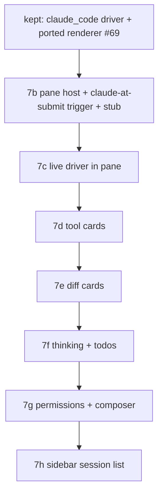

# Claude Code panel — TECH

Companion to [PRODUCT.md](PRODUCT.md). Section numbers in the Testing table refer to PRODUCT.md invariants.

> **File:line references below are point-in-time** (gathered 2026-06-02). The `warp` app crate churns; re-grep symbols before editing rather than trusting a line number.

## Re-spec (2026-06-02): terminal-triggered main-pane chat

This document was re-spec'd after **PR #69** (sub-phase 7b) shipped the panel as a **left-sidebar tab** and was rejected on sight. The earlier design (a left-panel toolbelt tab opened by ⌘⌥K, with the chat rendered in the sidebar) was the wrong product direction. The corrected design:

- **Entry point:** running `claude` in a terminal is intercepted at submit and opens the rich pane (no toolbelt button, no chord for the chat).
- **Host surface:** the chat is a **first-class main-content pane** (`IPaneType::ClaudeCode`), opened like an editor/terminal tab — not the sidebar.
- **Sidebar:** repurposed to a **read-only session list** (history) for the cwd, shown only when sessions exist.
- **Visual bar:** restyle the ported renderer to match Anthropic's **Claude desktop / Claude Code app**.

### What carries over from #69 (unchanged) vs what's dropped

**Kept (placement-agnostic — re-introduce from PR #69's branch `twarp-07b-port`):**

- **`crates/claude_code/`** — the headless driver crate: `lib.rs` (`Transcript` / `TranscriptEvent` / `TranscriptItem`), `driver.rs` (subprocess + defensive stream-json parser + SIGINT interrupt + stdin writer), `sessions.rs` (encoded-cwd + `list_sessions` + title parser). **19 passing unit tests.** This is the model the UI renders and the bridge's target; it does not change.
- **The ported transcript renderer** — `app/src/claude_code_panel/mod.rs` from #69 already ports `ai_assistant::transcript::render_message` (markdown body: `FormattedTextElement` for prose + a bordered monospace box for fenced code) and the AI-agnostic markdown splitter, reusing feature 03's `parse_markdown` → `FormattedTextElement` stack. This rendering code moves into the pane's view largely intact; the tool/diff/thinking/todo leaves (7d–7f) port onto it per the matrix below.

**Dropped (the sidebar design):**

- The left-panel placement: `ToolPanelView::ClaudeCode`, the toolbelt button, the render arm embedding the chat in the sidebar, the `LeftPanelDisplayedTab::ClaudeCode` active-view restore, and the ⌘⌥K toggle (`WorkspaceAction::ToggleClaudeCodePanel`, the `CustomAction` + `custom_tag_to_keystroke` binding). The chat no longer lives in the left panel. *(A trimmed left-panel entry returns in 7h, but as a read-only session list, not a chat host — see §Sidebar.)*
- Any `claude_code_panel::ClaudeCodePanelView` shaped as a `LeftPanelView` child. The view is re-hosted as a pane `BackingView` (see §The pane).

## Context

twarp wants the *rendering* layer of Warp's Agent Mode back, driven by the local `claude` CLI, with **none** of the service layer feature 02 deleted, hosted in a main-content pane and entered by typing `claude`. Three parts: (a) a **terminal trigger** that intercepts `claude` at submit and opens the pane; (b) a **pane host** that puts the chat where editors/terminals live; (c) the **renderer** (kept) + **driver** (kept) inside it.

### What feature 02 deleted, and what survives (renderer source)

The renderer is recoverable from commit **`fea2f7ea`** (the feature-02 *spec* commit, which predates every code-deletion PR). Two distinct surfaces lived there — **do not conflate them**:

- **`app/src/ai_assistant/`** — the older "Warp AI" Q&A panel (markdown prose + code blocks). Its `transcript.rs::render_message` + `utils.rs` markdown splitter are the **markdown-transcript** port target (already done in #69).
- **`app/src/ai/blocklist/`** — **Agent Mode**: the rich tool-card / diff / thinking / todo surface. Its `inline_action/*` card chrome and `block/view_impl/*` helpers are the **card** port targets (7d–7f), deeply coupled to the deleted AI models and ported per-leaf.

The per-file decision matrix (which leaf to port / reparent / rewrite / reuse) is **unchanged by this re-spec** — the rendering leaves don't care whether they live in a sidebar or a pane. It is reproduced condensed below.

## The trigger: intercept `claude` at submit (new)

The user types `claude [args]` and presses Enter in a terminal. twarp recognizes the command and, instead of writing it to the PTY, opens a Claude Code pane.

**Submit path** (`app/src/terminal/input.rs`, ~point-in-time lines):

- `input_enter()` (~12723) handles Enter; the raw command text is `self.editor...buffer_text(ctx)` (~12780).
- `try_execute_command_from_source()` (~7229) runs validation (`can_execute_command()`, ~7334) and then commits via `start_block_and_write_command_to_pty()` (~14014), which emits `Event::ExecuteCommand(ExecuteCommandEvent { command, session_id, source, .. })` (struct at `terminal/view.rs` ~2860).

**Hook (recommended).** In `try_execute_command_from_source()`, **after** `can_execute_command()` succeeds and **before** `start_block_and_write_command_to_pty()`, test whether the command is a top-level interactive `claude` invocation; if so, emit a terminal-view event (e.g. `Event::OpenClaudeCodePane { args, cwd }`) and **return without** the PTY write. `TerminalView`'s input-event handler (`terminal/view.rs::handle_input_event`, ~19640) forwards it up to the workspace, which opens the pane (§The pane).

**Conservative detection (PRODUCT §3).** Recognize only a bare top-level `claude` program token:

- Tokenize with the existing `warp_completer::parsers::simple` (precedent: `terminal/alias.rs:34`, `terminal/package_installers.rs:6`) — do **not** hand-roll shell parsing.
- Intercept only when the parsed command is a single simple command whose program is exactly `claude` (not a path, not piped, not `&&`/`;`-chained, not inside a subshell, not an argument to another program). When in doubt, **run it raw** — never swallow a command the user meant for the shell.
- Forward the remaining args to the session (PRODUCT §2): a trailing positional becomes the first user turn; recognized flags (`--resume`, `--model`, `--permission-mode`) map onto `SpawnOptions`; unknown flags are passed through to `claude` where safe.
- If `claude` is not on `PATH`, do **not** intercept (let the shell's own error stand), PRODUCT §4.

The terminal block, once intercepted, prints a one-line inline note ("Opened Claude Code in a pane") so the command isn't silently swallowed (PRODUCT §1). Implement via the existing block/banner mechanism rather than writing to the PTY.

## The pane: `IPaneType::ClaudeCode` (new host)

The chat is a main-content pane modeled on the **code editor pane**. Reference implementation: `app/src/pane_group/pane/code_pane.rs` (`CodePane` wrapping `PaneView<CodeView>`).

**Touch-points (mirror `CodePane`/`CodeView`):**

- **`app/src/pane_group/pane/mod.rs`**: add `IPaneType::ClaudeCode` to the enum (~128–146); add the render arm in `PaneId::render()` (~374–449) → `ChildView::<PaneView<ClaudeCodeView>>::with_id(..)`; add a `PaneId::from_claude_code_pane_*` factory alongside the existing ones.
- **`app/src/pane_group/pane/claude_code_pane.rs`** (new): `ClaudeCodePane` implementing `PaneContent` (id / pre_attach / attach / detach / snapshot / focus), wrapping `PaneView<ClaudeCodeView>`. `new(SpawnOptions-ish, ctx)` and `from_view(view, ctx)` like `CodePane`.
- **`ClaudeCodeView`** (the pane's `BackingView`): owns the `claude_code::Transcript`, the docked composer (`EditorView`), the driver session, and the per-`TranscriptItem` render dispatch. Provides `render_header_content()` (title "Claude Code" + cwd / session snippet), `close()` (drops the live session → kills `claude`), `focus_contents()` (focus the composer). This is where #69's ported renderer is re-hosted.
- **Open a pane:** from the workspace's handler for the terminal trigger event, call `pane_group.add_pane_with_direction(.., ClaudeCodePane::new(..), focus=true, ctx)` (`pane_group/mod.rs::add_pane_with_direction` ~5094). Provisional placement: a new tab in the active tab's group (PRODUCT §load-bearing-2).
- **Persistence (provisional):** add `LeafContents::ClaudeCode(..)` (`app_state.rs` ~721) + a restore arm (`pane_group/mod.rs::restore_pane_leaf` ~1666) **but** have `snapshot()` persist only the session id (or nothing) and `is_persisted()` (~756) restore to a **resume affordance / empty pane**, not a replayed transcript — twarp keeps no transcript store (PRODUCT non-goals; live history comes from `claude --resume`). Decide in 7c/7h; simplest first cut is a non-persisted pane.

This gives the chat real-pane behavior (resize, split, move, close, tab title) for free (PRODUCT §5), exactly like an editor tab.

## The chat UI inside the pane (kept renderer, restyled)

The `ClaudeCodeView` body is the kept renderer, laid out **Claude-app style**: a scrolling transcript (`UniformList`, bottom-stick auto-scroll, PRODUCT §14) above a **docked composer** (`EditorView`, PRODUCT §15). The per-`TranscriptItem` bridge dispatch (one `match` arm per item) feeds each ported leaf:

```
User(text)              → user turn (markdown body)
Assistant{text,done}    → assistant turn: parse_markdown → FormattedTextElement stack (§13); "…" cue while !done
Thinking{text,dur}      → collapsible "Thought for N s" card (§22)
Tool{name,input,status, → RenderableAction card: name→icon + status icon, summary = tool_input_summary,
  output}                 collapsible result; generic fallback for unmapped / mcp__* (§16–§19)
  …Edit/MultiEdit/Write  → diff card: synthesize unified diff → render READ-ONLY via feature 05 /
                           InlineDiffView (§20–§21)
Todos(Vec<TodoItem>)    → ported todos layout, in-place update (§23)
Permission{..}          → permission card (Allow/Deny when wire protocol works; else informational, §24/§26)
Notice / Error          → themed notice / verbatim copyable error card (§30)
```

### Per-file decision matrix (rendering leaves — unchanged from the prior spec)

`port`/`reparent` = bring back the GPUI element code, swap the model. `rewrite leaf` = reproduce the visual against the same theme/glyph contract (source too service-coupled to port). `reuse` = live on master. `extract` = lift helper fns only.

```
component (fea2f7ea path)                         action           notes
─────────────────────────────────────────────────────────────────────────────────────────────
ai_assistant/transcript.rs::render_message        DONE in #69      markdown body → reparented onto TranscriptItem
ai_assistant/utils.rs (markdown split)            DONE in #69      AI-agnostic splitter ported
markdown_parser + FormattedTextElement (master)   reuse            feature 03's live stack
inline_action/inline_action_icons.rs              port (pure)      status icons → ToolStatus
inline_action/inline_action_header.rs             port (leaf)      HeaderConfig + InteractionMode (Rc<dyn Fn>)
inline_action/requested_action.rs                 port (leaf)      RenderableAction builder (co-port WithContentItemSpacing)
inline_action/requested_command.rs                rewrite leaf     View bound to BlocklistAIActionModel — rebuild read-only from chrome
inline_action/code_diff_view.rs                   do NOT port      3190-line interactive editor → reuse feature 05 / InlineDiffView (read-only)
block/view_impl/output.rs                         extract helpers  reuse Reasoning arm + render_collapsible_text_block_section + format_elapsed_seconds
block/view_impl/common.rs                          extract helpers  render_rich_text_output_text_section + format_elapsed_seconds
block/view_impl/todos.rs                          port leaf+bridge AIConversation/AIAgentTodo → our TodoItem/TodoStatus
block/view_impl/{header,query}.rs                 do NOT port / opt our pane header is net-new; user row folds into the ported transcript
code_review_view.rs / inline_diff::InlineDiffView reuse            feature 05's themed read-only diff renderer
```

Diff/command cards reuse the clean `inline_action` chrome + feature 05's diff — never `code_diff_view.rs` (interactive editor) or a fresh `Flex`/`Container`/`Link` tree. The **Claude-app restyle** (turn spacing/alignment, composer chrome, card padding/typography) layers on top of these leaves; it is styling, not a rebuild — every card/diff/thinking block still traces to a ported leaf or a reused master renderer.

## The driver (`crates/claude_code`) — kept

Re-introduced from #69 unchanged. Subprocess: `command::r#async::Command::new("claude")` with `-p --input-format stream-json --output-format stream-json --verbose [--include-partial-messages] [--model ..] [--resume <id>] [--permission-mode ..]`, `current_dir(pane_cwd)`, all pipes, `kill_on_drop(true)`. A background task parses stdout line-by-line (a bad line is dropped, not fatal — PRODUCT §29) into `TranscriptEvent`s on a channel; the pane's `apply_event` pump applies them to the `Transcript` on the main thread. User turns + permission responses are written as JSONL to stdin. **`--verbose` mandatory** with `stream-json`; **never `--bare`** (skips OAuth/keychain). The session spawns on the first message (or immediately if `claude <prompt>` carried one, PRODUCT §6).

## Sidebar: read-only session list (7h)

A trimmed left-panel entry lists past sessions for the cwd using the kept `claude_code::sessions::list_sessions` reader. It hosts **no chat** — selecting an entry opens a Claude Code pane via `claude --resume <id>` (PRODUCT §35–§38). It appears only when sessions exist. This is a small left-panel view (a list with click-to-resume), far smaller than #69's sidebar chat; it may reuse a minimal `ToolPanelView` entry **or** surface from the new-session menu — decide in 7h. No transcript rendering lives here.

## Re-derived sub-phase plan

7b is re-scoped to the **pane host + trigger + re-hosted renderer**; later sub-phases are unchanged in spirit (cards/diffs/thinking/permissions/sessions), now landing in the pane.

- **7b — Pane host + trigger + ported transcript (stub session).** Re-introduce `crates/claude_code` + the ported markdown renderer from #69. Add `IPaneType::ClaudeCode` + `ClaudeCodePane`/`ClaudeCodeView` (modeled on `CodePane`). Add the `claude`-at-submit interceptor → opens the pane. Render a **synthetic** transcript (no driver) in the pane with a docked composer. Drop all left-panel/⌘⌥K placement. **Acceptance: running `claude` opens a real main-content pane whose sample transcript renders as themed Markdown in Claude-app shape** (PRODUCT smoke 1–4; §1–§7, §12–§15, §32–§33).
- **7c — Live driver in the pane.** Wire the kept `claude_code::driver` to the pane via the bridge + `apply_event` pump; remove the stub. Streaming/Stop/lifecycle/teardown; forward the `claude <prompt>` first turn. PRODUCT §6–§14, §28–§31.
- **7d — Tool cards.** Port `inline_action` chrome (icons/header/requested_action + `WithContentItemSpacing`); bridge `Tool` → cards + generic fallback. PRODUCT §16–§19.
- **7e — Diff cards.** Synthesize unified diff (kept `diff_for_tool`) → render read-only via feature 05 / `InlineDiffView`. PRODUCT §20–§21.
- **7f — Thinking + todos.** Extract collapsible-thinking helpers; port `todos.rs` bridged to `TodoItem`/`TodoStatus`. PRODUCT §22–§23.
- **7g — Permissions + composer.** Permission-mode selector → `--permission-mode` (robust path first); interactive prompts version-gated with §26 degradation; composer semantics. PRODUCT §24–§27.
- **7h — Sidebar session list + resume.** Kept `sessions.rs` reader → read-only left-panel list; resume opens a pane via `--resume`. PRODUCT §35–§38.



## Feature flag & rollout

**Always-on, no flag.** Acceptable on a personal fork; the trigger no-ops cleanly when `claude` is absent (PRODUCT §4) and the pane is only created on demand, so always-on breaks nothing on a machine without Claude Code. Re-add a flag only if this ever ships beyond the fork.

## Testing and validation

`crates/claude_code` is the unit-test workhorse (19 tests, kept). The pane relies on view tests + manual smoke (PRODUCT smoke is the per-sub-phase acceptance gate). **Acceptance gate: visually consistent with the Claude desktop / Claude Code app** — chat turns, docked composer, themed cards, +/- tinted diffs, collapsible thinking, a real task list — not a primitive dump.

| PRODUCT § | Verification | Phase |
|---|---|---|
| §1–§3 (trigger, conservative detection) | Unit: command-parse classifier (claude vs piped/path/chained → intercept y/n). Manual: `claude`, `claude foo`, `echo x | claude`, `/full/path/claude`. Smoke 1,4. | 7b |
| §5–§8 (pane lifecycle) | Manual: open/resize/split/close pane; second pane independent; quit kills process. Smoke 3,7. | 7b/7c |
| §12–§15 (markdown transcript, composer) | **View test: synthetic items render as markdown + code blocks via the ported renderer; docked composer.** Smoke 2,5. | 7b/7c |
| §9–§11, §28–§31 (streaming, stop, defensive parse) | Driver integration + parser unit tests on golden transcripts; manual stream/stop/kill. Smoke 5–7. | 7c |
| §16–§19 (tool cards) | Unit: per-tool summary; unknown/`mcp__*` → generic. **View test: RenderableAction card, not a text row.** Smoke 8. | 7d |
| §20–§21 (diff cards) | Unit: old/new → unified diff; **view test reuses feature 05 (themed +/- tint), read-only.** Smoke 8. | 7e |
| §22–§23 (thinking, todos) | Unit: duration parse; in-place todo update. **View test: collapsible card + ported todos.** Smoke 8. | 7f |
| §24–§27 (permissions, composer) | Integration vs pinned `claude`; unit mode→flag; manual composer + §26 degradation. Smoke 9. | 7g |
| §35–§38 (sidebar list, resume) | Unit: encoded-cwd + title parse; integration: create→list→resume; corrupt → graceful. Smoke 10–11. | 7h |
| §32–§34 (Claude-app visual, privacy, theming) | Audit: only egress is local `claude`; no `Color::rgb(`; side-by-side with the Claude app. Smoke 12–13. | all |

**Version pinning.** Pin the tested `claude` version, assert via `claude --version`, capture golden stream-json transcripts as parser fixtures. `./script/presubmit` should pass before each impl PR (the owner's Mac can't run it fully — rely on `cargo check`/`clippy`/`fmt` + `cargo test -p claude_code`; the `warp` app crate is one large crate, so each `cargo check -p warp` is a multi-minute full recompile).

## Risks and mitigations

- **Breaking real terminal commands (new top risk).** Over-eager interception could swallow a command the user meant for the shell. **Mitigation:** conservative detection (§The trigger) — only a bare top-level `claude` program token, parsed with the existing completer parser, intercepted; when in doubt run it raw. Unit-test the classifier hard.
- **Re-building from primitives (the #67/#69 failure).** **Mitigation:** the per-file matrix + the Claude-app acceptance gate; every card/diff/thinking block traces to a ported leaf or a reused master renderer.
- **Pane persistence semantics.** A restored pane can't replay a live `claude` process. **Mitigation:** persist at most the session id and restore to a resume affordance (or don't persist); never fabricate a transcript store (PRODUCT non-goals).
- **Undocumented permission control protocol (highest runtime risk, 7g).** **Mitigation:** build `--permission-mode`/`--allowedTools` first; interactive prompts version-gated with §26 degradation.
- **Subscription billing change 2026-06-15.** **Mitigation:** surface `claude`'s own errors verbatim (§30); meter nothing.
- **Schema drift.** **Mitigation:** defensive parsing (§29), catch-alls, version pin + golden fixtures (in the kept crate).

## Follow-ups

- Split-pane / replace-the-terminal placement if "new tab" feels wrong (PRODUCT §load-bearing-2).
- Richer Ctrl+G composer host (PRODUCT §27).
- MCP `--permission-prompt-tool` server as a stable alternative to the wire control channel.
- Persisted/restorable session panes across restart (beyond resume-affordance), if wanted.
