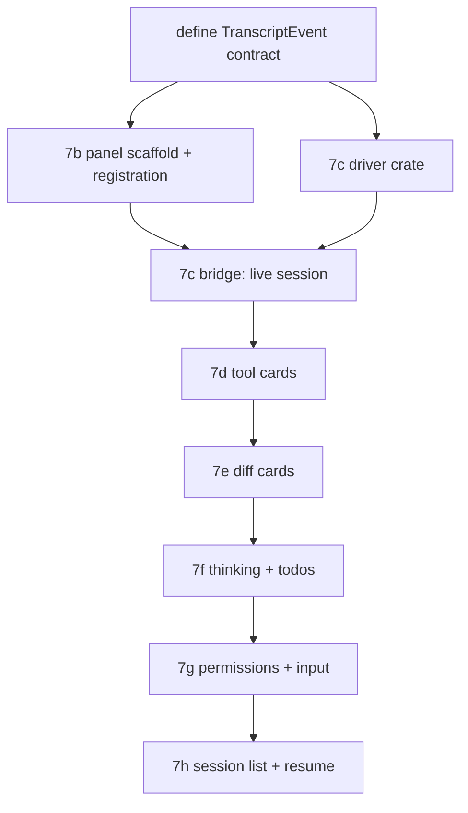

# Claude Code panel — TECH

Companion to [PRODUCT.md](PRODUCT.md). Section numbers in the Testing table refer to PRODUCT.md invariants. This document is the deliverable of sub-phase **7a** (audit + tech spec); it resolves the "can the rendering layer be detangled from the service layer?" gate and defines the cherry-pick/port targets and the driver-translation layer. Impl begins at **7b**.

## Context

twarp wants the *rendering* layer of Warp's Agent Mode back, driven by the local `claude` CLI, with **none** of the service layer feature 02 deleted. Two halves: (a) a UI that renders a conversation in Warp's Agent-Mode shape, (b) a subprocess driver that runs `claude --output-format stream-json` and translates its events into that UI's model.

### What feature 02 deleted, and what survives

Feature 02 (PRs #6–#18) removed the AI service and the conversation renderer together. The renderer is recoverable from commit **`fea2f7ea`** (`[twarp 02] specs: ai-removal (#4)`) — the feature-02 *spec* commit, which predates every code-deletion PR, so the full renderer is intact there. Verified: `git show fea2f7ea:app/src/ai_assistant/panel.rs`, `…/ai/blocklist/inline_action/code_diff_view.rs`, and `…/ai/blocklist/block/view_impl/todos.rs` all return content; all three are absent on master.

The deleted rendering artifacts worth porting (paths at `fea2f7ea`):

| Component | Path @ `fea2f7ea` | Renders |
|---|---|---|
| Conversation panel shell | `app/src/ai_assistant/panel.rs` | header, toolbar, scroll container |
| Transcript view | `app/src/ai_assistant/transcript.rs` | ordered message stream, markdown segments, code blocks |
| Tool-call cards | `app/src/ai/blocklist/inline_action/{mod,inline_action_header,inline_action_icons,requested_*}.rs` | per-tool structured cards |
| Diff card | `app/src/ai/blocklist/inline_action/code_diff_view.rs` | inline old→new diff |
| Thinking + output blocks | `app/src/ai/blocklist/block/view_impl/{output,header,query}.rs` | streaming text, thinking blocks |
| Todo list | `app/src/ai/blocklist/block/view_impl/todos.rs` | task/plan list |

**Detangle gate — resolved: port-and-adapt, evaluated per component (not a clean `git restore`, not a full clean-room).** Every file above still `use`s sibling service types (`crate::ai::skills::…`, the `Requests`/`LLMResponse` lifecycle, agent-profile context). A wholesale `git restore` would drag back exactly what feature 02 removed. So 7b **ports the leaf rendering code as a starting point and reparents it onto a new, thin twarp-side model**, dropping every `crate::ai::` service import. The service-coupled pieces — `requests.rs` (LLM request lifecycle), `blocklist/controller.rs` (tool execution), `agent_view/agent_input_footer/` (context chips tied to agent profiles), all of `crates/ai/` — are **not** ported; the subprocess driver and a plain input replace them. Per-component rule: if porting a component pulls in more `crate::ai::` coupling than rewriting it from GPUI primitives costs, rewrite it. This keeps the gate a cheap per-file decision during 7b rather than an all-or-nothing bet.

### Surviving scaffolding (reuse / avoid)

- **Left-panel registration.** `ToolPanelView` enum at `app/src/workspace/view/left_panel.rs:193`; `LeftPanelDisplayedTab` at `app/src/app_state.rs:889` with the `From<ToolPanelView>` impl at `:904`; toolbelt button config in `left_panel.rs` (the `ConversationListView` arm at `:977` is the shape to copy); render/focus dispatch in `left_panel.rs`; availability list `compute_left_panel_views` at `app/src/workspace/view.rs:18083`, which already gates an entry on `FeatureFlag::AgentViewConversationListView.is_enabled()` at `:18085` — the natural neighbor for our flag-gated push.
- **Dead `ConversationListView` stub.** Present across `left_panel.rs:161/204/977/1248` and `app_state.rs:510/894/904`, kept only so legacy call-sites compile. **Do not repurpose it** — it is entangled with the dead `FeatureFlag::AgentViewConversationListView` path (`workspace/view.rs:7223/10135/18085`) and the stub `AIConversationId` (`app/src/editor/view/mod.rs:84`). Add a clean `ClaudeCode` variant instead; leave the stub alone.
- **Keybinding hook.** `CustomAction` enum at `app/src/util/bindings.rs:32`; `custom_tag_to_keystroke` at `:266`. **Per the feature-06 lesson (and twarp keybinding memory): assign the default chord in `custom_tag_to_keystroke`, never via `EditableBinding::with_key_binding`** — the latter clobbers `Trigger::Custom` and panics the mac menu at startup. The binding stays an `EditableBinding` so it remains remappable (PRODUCT §2).
- **Subprocess precedent.** `app/src/util/git.rs:26` (`command::r#async::Command`, `Stdio::piped()`, `kill_on_drop(true)`) and the **stdin-capable** variant at `:91` (`.stdin(Stdio::piped())`). This is the exact pattern for spawning `claude` with piped stdin/stdout and guaranteed teardown on drop (PRODUCT §15).
- **Streaming scroll.** `UniformList` + `UniformListState` as used by Global Search (`app/src/workspace/view/global_search/view.rs:314`, init `:709`). Bottom-stick auto-scroll (PRODUCT §22) layers on top.
- **Diff rendering.** Feature 05's renderer — `render_file_content` at `app/src/code_review/code_review_view.rs:5984` and the `CodeReviewEditorView` it drives — already renders a unified diff from a string source. Reuse it for diff cards (PRODUCT §30–§33).
- **Markdown.** Reuse whatever rendered-Markdown path feature 03 established (and the existing fenced-code highlighter); locate the shared renderer during 7b rather than porting `transcript.rs`'s coupled markdown helpers wholesale.

## Proposed changes

### Module/crate layout

- **New crate `crates/claude_code/`** (headless, no GPUI): the protocol + driver. Owns the stream-json wire types, a defensive JSONL parser, the subprocess lifecycle, stdin writer, and the `~/.claude/` session-store reader. Pure and unit-testable against golden transcripts. This is the "new crate" STATUS 7c calls for.
- **New app module `app/src/claude_code_panel/`** (GPUI): the panel view, the ported/adapted cards, the transcript model the view renders, and the bridge that pumps driver events onto the main thread. Depends on `crates/claude_code`.

### The driver-translation layer (`crates/claude_code`)

Wire types mirror the stream-json schema (defensive: `#[serde(other)]` catch-alls, all non-essential fields `Option`):

```rust
// crates/claude_code/src/event.rs — what `claude` emits on stdout
enum ClaudeStreamEvent {
    System { subtype: SystemSubtype, session_id: Option<String>, /* init: model, tools, cwd, permission_mode */ .. },
    Assistant { message: ApiMessage, .. },   // content blocks: Text | Thinking | ToolUse
    User      { message: ApiMessage, .. },    // content blocks: ToolResult | Text
    StreamEvent { event: serde_json::Value, .. }, // partial deltas (--include-partial-messages)
    Result    { subtype: ResultSubtype, is_error: bool, result: Option<String>, total_cost_usd: Option<f64>, .. },
    #[serde(other)] Unknown,                  // PRODUCT §53: tolerate unknown types
}
```

The driver translates `ClaudeStreamEvent` → a small twarp-native `TranscriptEvent` the UI consumes, so the UI never sees raw claude JSON:

```rust
enum TranscriptEvent {
    UserMessage(String),
    AssistantTextDelta { text: String },      // or whole-message if partials unavailable (§17)
    AssistantTextDone,
    Thinking { text: String, duration: Option<Duration> },   // §34
    ToolCall { id: String, name: String, input: serde_json::Value },   // §23
    ToolResult { id: String, output: ToolOutput, is_error: bool },     // §26
    Todos(Vec<TodoItem>),                      // from TodoWrite (§37)
    PermissionRequest { id: String, tool: String, input: serde_json::Value }, // §39 (see Risks)
    SessionInit { session_id: String, cwd: PathBuf },
    Ended { reason: EndReason },               // success | interrupted | error | exited (§52)
}
```

Subprocess: `command::r#async::Command::new("claude")` (resolved on `PATH`; absence → the unavailable state, PRODUCT §6) with
`-p --input-format stream-json --output-format stream-json --verbose [--include-partial-messages] --model <cfg> [--resume <id>] [--permission-mode <mode>] [--allowedTools …]`,
`current_dir(panel_cwd)`, all three pipes, `kill_on_drop(true)` (§15). A background task reads stdout line-by-line, parses each line independently (a bad line is dropped, not fatal — §53), and forwards `TranscriptEvent`s over a channel to the UI. User messages (§8/§16) and, if used, permission responses (§39) are written as JSONL to stdin. **`--verbose` is mandatory** with `stream-json` or only the final result is emitted; **`--bare` must not be used** (it skips OAuth/keychain and would break implicit Max-subscription auth).

### The panel (`app/src/claude_code_panel/`)

- **Registration (7b).** Add `ToolPanelView::ClaudeCode` (`left_panel.rs:193`), `LeftPanelDisplayedTab::ClaudeCode` (`app_state.rs:889`) + `From` arm (`:904`), a toolbelt button config modeled on the `ConversationListView` arm (`:977`), a render arm dispatching to `render_claude_code_panel`, and a `compute_left_panel_views` push (`view.rs:18083`) gated on the new feature flag, beside the existing `AgentViewConversationListView` gate.
- **Keybinding (7b).** New `WorkspaceAction::ToggleClaudeCodePanel` + `CustomAction::ToggleClaudeCodePanel`; map the default chord (**⌘⌥K**, see conflict-check below) in `custom_tag_to_keystroke` (`bindings.rs:266`); register an `EditableBinding` for remap.
- **Transcript model + view (7b).** A `Transcript` (ordered `Vec<TranscriptItem>`) owned by the panel view; `UniformList` renders it with bottom-stick auto-scroll (§22). Ported cards reparented onto `TranscriptItem`. 7b ends with the panel registering, opening, and rendering an empty/zero state (PRODUCT §5) with no live session.
- **Driver bridge (7c).** Panel spawns the driver on first send (§8), holds the `Child` + stdin handle + event channel, and applies `TranscriptEvent`s to the model on the main thread. Streaming/Stop/end map to PRODUCT §10–§13.
- **Cards (7d/7e/7f).** `ToolCall`+`ToolResult` → tool card with per-tool summaries (§24) and a generic fallback for unmapped/`mcp__*` tools (§25); `Edit`/`MultiEdit`/`Write` → diff card via the code-review diff primitive, synthesizing a unified diff from `old_string`/`new_string` (§30–§33); `Thinking` → collapsible card (§34); `Todos` → in-place task list (§37).
- **Permissions + input (7g).** Permission-mode selector (§41) maps to `--permission-mode`; message input per §43–§45. Interactive prompts (§39) — see Risks.
- **Session list/resume (7h).** Read `~/.claude/projects/<encoded-cwd>/*.jsonl` (`<encoded-cwd>` = absolute cwd with every non-alphanumeric char → `-`); list + resume via `claude --resume <id>` (§46–§50). Hand-parsing the on-disk JSONL for titles is the drift-prone part — keep it best-effort and degrade to "untitled session + timestamp" if a file doesn't parse.

### Feature flag & rollout

Gate the whole panel behind a new `FeatureFlag::ClaudeCodePanel` (use the `add-feature-flag` skill), so the `compute_left_panel_views` push and the keybinding context-predicate are flag-guarded. Ship 7b–7h dogfood-only; promote to Preview/Stable via `promote-feature` once the driver is proven against the pinned `claude` version.

### Chord conflict-check (do before finalizing §2)

Apply the feature-06 discipline: grep existing bindings for `cmd-alt-k` / `cmdorctrl-alt-k` and confirm no live action claims it (watch for dead post-AI-removal bindings like the `ResumeConversation` case 06 hit). If ⌘⌥K is taken, fall back to an unused ⌘⌥ chord and record the choice in STATUS.

## Testing and validation

`crates/claude_code` is the unit-test workhorse; the panel relies on view tests + manual smoke (the PRODUCT smoke test is the acceptance gate per sub-phase).

| PRODUCT § | Verification | Phase |
|---|---|---|
| §1–§3 (surface, chord, width) | Manual: toolbelt entry, toggle, width persistence. Smoke 1–3. | 7b |
| §4 (cwd scoping) | Unit (encoded-cwd) + manual. Smoke 22–23. | 7b/7h |
| §5–§7 (zero/unavailable/no-autostart) | Manual: zero state, hide `claude` → unavailable, verify no process on open. Smoke 4–5. | 7b |
| §8–§15 (lifecycle, stop, hide, teardown) | Integration (driver spawn/stop/kill-on-drop) + manual. Smoke 6–10. | 7c |
| §16–§22 (messages, streaming, scroll) | Parser unit tests on golden transcripts; manual stream + auto-scroll. Smoke 6–7. | 7c |
| §23–§29 (tool cards) | Unit: each known tool → expected summary; unknown/`mcp__*` → generic card. View tests. Smoke 11–13. | 7d |
| §30–§33 (diff cards) | Unit: `old/new` → unified diff; view test reuses code-review renderer. Smoke 14–15. | 7e |
| §34–§38 (thinking, todos) | Unit: thinking duration parse; TodoWrite → in-place list update (no duplicate lists). Smoke 16–17. | 7f |
| §39–§45 (permissions, input) | Integration against pinned `claude` for prompts; unit for mode→flag; manual input semantics + §42 degradation. Smoke 18–21. | 7g |
| §46–§51 (session list/resume) | Unit: encoded-cwd path + best-effort title parse; integration: create→list→resume; corrupt file → graceful error. Smoke 22–25. | 7h |
| §52–§57 (errors, defensive parse) | **Unit (critical):** unknown event type, unknown content block, missing field, non-JSON line, truncated event → no crash/stall. Manual: kill `claude` mid-turn. Smoke 25. | 7c (parser), all |
| §55 (auth/billing verbatim) | Manual: trigger an auth/limit error → surfaced verbatim, copyable; no twarp billing UI. Smoke 26. | 7c/7g |
| §58–§62 (privacy, theming, a11y) | Audit: only egress is the local `claude` process; no `Color::rgb(`; keyboard reachability. Smoke 26–27. | all |

**Version pinning (cross-cutting).** Pin the tested `claude` version (`claude install <version>`), assert it at runtime via `claude --version`, and capture golden stream-json transcripts as parser fixtures so schema drift fails a `crates/claude_code` test before it reaches users. `./script/presubmit` must pass before each impl PR.

## Risks and mitigations

- **Undocumented permission control protocol (highest risk, 7g).** The stdin/stdout `control_request`/`control_response` channel `claude` uses for interactive permission decisions is **not** part of its documented public interface (Anthropic acknowledges the gap) and may change between versions. **Mitigation:** build the *robust* path first — the `--permission-mode` selector + `--allowedTools` pre-approval (official, stable, PRODUCT §41). Treat interactive in-transcript prompts (§39–§40) as an enhancement gated behind the pinned-version check, with the §42 degradation (surface denials after the fact; never hang). If the wire channel proves unusable, an MCP `--permission-prompt-tool` server is the documented fallback (heavier; defer).
- **Subscription billing change 2026-06-15.** `claude -p` on subscription plans will draw from a separate monthly Agent-SDK credit (today is 2026-05-26 — inside the impl window). **Mitigation:** the panel only ever surfaces `claude`'s own auth/limit errors verbatim (§55); it meters nothing. Note it in the dogfood release notes so testers aren't surprised when the panel reports a limit the interactive CLI didn't.
- **Schema drift.** The stream-json schema is the Agent-SDK contract and evolves. **Mitigation:** defensive parsing (§53), `#[serde(other)]` catch-alls, version pin + golden fixtures.
- **Porting drags in service coupling.** **Mitigation:** the per-component port-and-adapt rule above; reparent onto the thin model, rewrite a component if porting costs more than rebuilding.
- **Cramped conversation in a narrow left panel.** A rich conversation in a side panel may feel tight — this is the most likely respec point (cf. feature 05's panel-placement respec). **Mitigation:** panel is resizable (§3); PRODUCT §51 leaves the full-pane alternative open. Decide after 7b renders something real.
- **Cherry-pick churn vs upstream (why 07 precedes rebrand).** Porting from `fea2f7ea` touches `app/src/ai*` paths that still exist as `warp_*`-era names; doing this before feature 08's rebrand keeps the port aligned with upstream names.

## Parallelization

The impl sub-phases are mostly **sequential**: 7c needs 7b's `Transcript` model; 7d/7e/7f consume 7c's `TranscriptEvent`s; 7g/7h build on a live session. Each ships as its own PR (STATUS 7b–7h).

The one genuinely isolatable split is **within 7b–7c**, along the crate boundary:

- **Agent `driver`** — owns `crates/claude_code` (wire types, parser, subprocess, session-store reader). Headless, unit-tested against golden transcripts. No GPUI. Mode: `local`, worktree `../twarp-07-driver`, branch `twarp-07c-driver`.
- **Agent `panel`** — owns `app/src/claude_code_panel/` + registration/keybinding (7b). Mode: `local`, worktree `../twarp-07-panel`, branch `twarp-07b-panel`.

**Coordination:** the two meet only at the `TranscriptEvent` enum. Define that enum first, in `crates/claude_code`, as the contract; both agents import it. `driver` owns the crate; `panel` owns the app module and treats the crate as a dependency. They land as two PRs (7b then 7c), `panel` rebasing on `driver` once the event contract is committed.

Single-engineer twarp benefits little from wall-clock parallelism (cf. feature 05's note), but the parser/UI boundary is clean enough that the split is worth it if a second agent is available — the parser can be fixture-tested with zero UI, and the UI can be view-tested against synthetic `TranscriptEvent`s with no live `claude`. 7d–7h remain sequential single-agent work.



## Follow-ups

- Full-pane surface (vs left panel) if 7b's render feels cramped (PRODUCT §51).
- Richer Ctrl+G input host (PRODUCT §45) if the plain input proves limiting.
- MCP `--permission-prompt-tool` server as a stable alternative to the wire control channel.
- Multi-session in-panel sub-tabs (PRODUCT §51) if single-session proves limiting.
