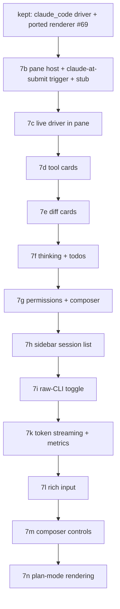

# Claude Code panel — TECH

Companion to [PRODUCT.md](PRODUCT.md). Section numbers in the Testing table refer to PRODUCT.md invariants.

> **File:line references below are point-in-time** (gathered 2026-06-02). The `warp` app crate churns; re-grep symbols before editing rather than trusting a line number.

## Re-spec (2026-06-02): terminal-triggered main-pane chat

This document was re-spec'd after **PR #69** (sub-phase 7b) shipped the panel as a **left-sidebar tab** and was rejected on sight. The earlier design (a left-panel toolbelt tab opened by ⌘⌥K, with the chat rendered in the sidebar) was the wrong product direction. The corrected design:

- **Entry point:** running `claude` in a terminal is intercepted at submit and opens the rich pane (no toolbelt button, no chord for the chat).
- **Host surface:** the chat is a **first-class main-content pane** (`IPaneType::ClaudeCode`), opened like an editor/terminal tab — not the sidebar.
- **Sidebar:** repurposed to a **read-only session list** (history) for the cwd, shown only when sessions exist.
- **Visual bar:** restyle the ported renderer to match Anthropic's **Claude desktop / Claude Code app**.

### What carries over from #69 (unchanged) vs what's dropped

**Kept (placement-agnostic — re-introduce from PR #69's branch `twarp-07b-port`):**

- **`crates/claude_code/`** — the headless driver crate: `lib.rs` (`Transcript` / `TranscriptEvent` / `TranscriptItem`), `driver.rs` (subprocess + defensive stream-json parser + SIGINT interrupt + stdin writer), `sessions.rs` (encoded-cwd + `list_sessions` + title parser). **19 passing unit tests.** This is the model the UI renders and the bridge's target; it does not change.
- **The ported transcript renderer** — `app/src/claude_code_panel/mod.rs` from #69 already ports `ai_assistant::transcript::render_message` (markdown body: `FormattedTextElement` for prose + a bordered monospace box for fenced code) and the AI-agnostic markdown splitter, reusing feature 03's `parse_markdown` → `FormattedTextElement` stack. This rendering code moves into the pane's view largely intact; the tool/diff/thinking/todo leaves (7d–7f) port onto it per the matrix below.

**Dropped (the sidebar design):**

- The left-panel placement: `ToolPanelView::ClaudeCode`, the toolbelt button, the render arm embedding the chat in the sidebar, the `LeftPanelDisplayedTab::ClaudeCode` active-view restore, and the ⌘⌥K toggle (`WorkspaceAction::ToggleClaudeCodePanel`, the `CustomAction` + `custom_tag_to_keystroke` binding). The chat no longer lives in the left panel. *(A trimmed left-panel entry returns in 7h, but as a read-only session list, not a chat host — see §Sidebar.)*
- Any `claude_code_panel::ClaudeCodePanelView` shaped as a `LeftPanelView` child. The view is re-hosted as a pane `BackingView` (see §The pane).

## Context

twarp wants the *rendering* layer of Warp's Agent Mode back, driven by the local `claude` CLI, with **none** of the service layer feature 02 deleted, hosted in a main-content pane and entered by typing `claude`. Three parts: (a) a **terminal trigger** that intercepts `claude` at submit and opens the pane; (b) a **pane host** that puts the chat where editors/terminals live; (c) the **renderer** (kept) + **driver** (kept) inside it.

### What feature 02 deleted, and what survives (renderer source)

The renderer is recoverable from commit **`fea2f7ea`** (the feature-02 *spec* commit, which predates every code-deletion PR). Two distinct surfaces lived there — **do not conflate them**:

- **`app/src/ai_assistant/`** — the older "Warp AI" Q&A panel (markdown prose + code blocks). Its `transcript.rs::render_message` + `utils.rs` markdown splitter are the **markdown-transcript** port target (already done in #69).
- **`app/src/ai/blocklist/`** — **Agent Mode**: the rich tool-card / diff / thinking / todo surface. Its `inline_action/*` card chrome and `block/view_impl/*` helpers are the **card** port targets (7d–7f), deeply coupled to the deleted AI models and ported per-leaf.

The per-file decision matrix (which leaf to port / reparent / rewrite / reuse) is **unchanged by this re-spec** — the rendering leaves don't care whether they live in a sidebar or a pane. It is reproduced condensed below.

## The trigger: intercept `claude` at submit (new)

The user types `claude [args]` and presses Enter in a terminal. twarp recognizes the command and, instead of writing it to the PTY, opens a Claude Code pane.

**Submit path** (`app/src/terminal/input.rs`, ~point-in-time lines):

- `input_enter()` (~12723) handles Enter; the raw command text is `self.editor...buffer_text(ctx)` (~12780).
- `try_execute_command_from_source()` (~7229) runs validation (`can_execute_command()`, ~7334) and then commits via `start_block_and_write_command_to_pty()` (~14014), which emits `Event::ExecuteCommand(ExecuteCommandEvent { command, session_id, source, .. })` (struct at `terminal/view.rs` ~2860).

**Hook (recommended).** In `try_execute_command_from_source()`, **after** `can_execute_command()` succeeds and **before** `start_block_and_write_command_to_pty()`, test whether the command is a top-level interactive `claude` invocation; if so, emit a terminal-view event (e.g. `Event::OpenClaudeCodePane { args, cwd }`) and **return without** the PTY write. `TerminalView`'s input-event handler (`terminal/view.rs::handle_input_event`, ~19640) forwards it up to the workspace, which opens the pane (§The pane).

**Conservative detection (PRODUCT §3).** Recognize only a bare top-level `claude` program token:

- Tokenize with the existing `warp_completer::parsers::simple` (precedent: `terminal/alias.rs:34`, `terminal/package_installers.rs:6`) — do **not** hand-roll shell parsing.
- Intercept only when the parsed command is a single simple command whose program is exactly `claude` (not a path, not piped, not `&&`/`;`-chained, not inside a subshell, not an argument to another program). When in doubt, **run it raw** — never swallow a command the user meant for the shell.
- Forward the remaining args to the session (PRODUCT §2): a trailing positional becomes the first user turn; recognized flags (`--resume`, `--model`, `--permission-mode`) map onto `SpawnOptions`; unknown flags are passed through to `claude` where safe.
- If `claude` is not on `PATH`, do **not** intercept (let the shell's own error stand), PRODUCT §4.

The terminal block, once intercepted, prints a one-line inline note ("Opened Claude Code in a pane") so the command isn't silently swallowed (PRODUCT §1). Implement via the existing block/banner mechanism rather than writing to the PTY.

### Session defaults: last-used store, alias as bootstrap (amends §2, 2026-06-27)

Originally a new pane's `model`/`effort`/`permission_mode` came **only** from the user's `claude` shell alias, re-expanded on every launch (`claude_pane_trigger`, and `claude_alias_launch_options` for the sidebar/resume paths). That is now a **bootstrap fallback**: defaults are remembered from the **previous session** and reused.

- **Store.** A single global SQLite row `claude_session_defaults(id, model, effort, permission_mode)` (migration `2026-06-27-000000_add_claude_session_defaults`; diesel model `ClaudeSessionDefaults`; `permission_mode` is `PermissionMode::as_cli_arg()`). Read once at startup into `PersistedData.claude_session_defaults`; held in the `ClaudeSessionDefaultsModel` singleton (`app/src/claude_code_session_defaults.rs`, mirrors `IgnoredSuggestionsModel`); written via `ModelEvent::UpsertClaudeSessionDefaults`. `is_seeded()` ⇔ a row exists.
- **Read (one chokepoint).** `ClaudeCodeView::new` fills any setting the invocation didn't pin from the store, then **records the effective settings back** as the new last-used. This covers all creation paths (typed trigger, sidebar resume, crash restore) and replaces the old per-restore `LaunchOptions::default()` (which silently dropped settings).
- **Write-through.** The in-pane mutators (`set_model`/`set_effort`/`set_permission_mode`/`approve_plan`) call `persist_session_defaults`, so an in-session change becomes the next pane's default.
- **Precedence.** typed per-invocation flags (`claude --model haiku`) > stored last-used > app default. Typed flags also update the store. The alias contributes **only while `!is_seeded()`**: `claude_pane_trigger` forwards just the user's literally-typed tokens once seeded (alias-expanded tokens during bootstrap), and `open_claude_code_resume_pane` skips `claude_alias_launch_options` once seeded.

## The pane: `IPaneType::ClaudeCode` (new host)

The chat is a main-content pane modeled on the **code editor pane**. Reference implementation: `app/src/pane_group/pane/code_pane.rs` (`CodePane` wrapping `PaneView<CodeView>`).

**Touch-points (mirror `CodePane`/`CodeView`):**

- **`app/src/pane_group/pane/mod.rs`**: add `IPaneType::ClaudeCode` to the enum (~128–146); add the render arm in `PaneId::render()` (~374–449) → `ChildView::<PaneView<ClaudeCodeView>>::with_id(..)`; add a `PaneId::from_claude_code_pane_*` factory alongside the existing ones.
- **`app/src/pane_group/pane/claude_code_pane.rs`** (new): `ClaudeCodePane` implementing `PaneContent` (id / pre_attach / attach / detach / snapshot / focus), wrapping `PaneView<ClaudeCodeView>`. `new(SpawnOptions-ish, ctx)` and `from_view(view, ctx)` like `CodePane`.
- **`ClaudeCodeView`** (the pane's `BackingView`): owns the `claude_code::Transcript`, the docked composer (`EditorView`), the driver session, and the per-`TranscriptItem` render dispatch. Provides `render_header_content()` (title "Claude Code" + cwd / session snippet), `close()` (drops the live session → kills `claude`), `focus_contents()` (focus the composer). This is where #69's ported renderer is re-hosted.
- **Open a pane:** from the workspace's handler for the terminal trigger event, call `pane_group.add_pane_with_direction(.., ClaudeCodePane::new(..), focus=true, ctx)` (`pane_group/mod.rs::add_pane_with_direction` ~5094). Provisional placement: a new tab in the active tab's group (PRODUCT §load-bearing-2).
- **Persistence (7m, DECIDED — PRODUCT §8a).** First cut shipped non-persisted (7b); 7m makes the pane restorable along exactly the line this section reserved: persist *only* the session id + cwd, never a transcript. `LeafContents::ClaudeCode(ClaudeCodePaneSnapshot { session_id: Option<String>, cwd: Option<String> })` (`app_state.rs`); `snapshot()` (`claude_code_pane.rs`) reads the view's live `session_id()`/`cwd()` and records the id **only when the session `.jsonl` exists on disk** (same `sessions::session_file(..).exists()` guard the raw-CLI `--resume` path uses) — a zero-state pane reports `session_id: None`. `is_persisted()` (`app_state.rs`) is `session_id.is_some()`, so zero-state panes are filtered exactly like `NetworkLog`. New SQLite table `claude_code_panes(id, kind, session_id, cwd)` (migration `2026-06-25-000000_add_claude_code_panes`, `CLAUDE_CODE_PANE_KIND = "claude_code"`, diesel model + schema). The restore arm (`pane_group/mod.rs::restore_pane_leaf`) rebuilds a `ResumeSession` from `session_file(cwd, id)` and calls the existing `ClaudeCodePane::new_resume(..)` — the same lazy resume the 7h session list uses, so **no process spawns on launch**; history loads from the `.jsonl` and the live `claude --resume` starts on the next message (consistent with §6). Missing/unreadable `.jsonl` ⇒ empty pane, never a dropped tab.

This gives the chat real-pane behavior (resize, split, move, close, tab title) for free (PRODUCT §5), exactly like an editor tab.

## The chat UI inside the pane (kept renderer, restyled)

The `ClaudeCodeView` body is the kept renderer, laid out **Claude-app style**: a scrolling transcript (`UniformList`, bottom-stick auto-scroll, PRODUCT §14) above a **docked composer** (`EditorView`, PRODUCT §15). The per-`TranscriptItem` bridge dispatch (one `match` arm per item) feeds each ported leaf:

```
User(text)              → user turn (markdown body)
Assistant{text,done}    → assistant turn: parse_markdown → FormattedTextElement stack (§13); "…" cue while !done
Thinking{text,dur}      → collapsible "Thought for N s" card (§22)
Tool{name,input,status, → RenderableAction card: name→icon + status icon, summary = tool_input_summary,
  output}                 collapsible result; generic fallback for unmapped / mcp__* (§16–§19)
  …Edit/MultiEdit/Write  → diff card: synthesize unified diff → render READ-ONLY via feature 05 /
                           InlineDiffView (§20–§21)
Todos(Vec<TodoItem>)    → ported todos layout, in-place update (§23)
Permission{..}          → permission card (Allow/Deny, answered over the control channel, §24)
Tool{name:AskUserQuestion} → inline question card; its gating can_use_tool is held open and
                          answered with the picks (updatedInput.answers), §1
Question{..}            → question card for a request_user_dialog (speculative path; claude
                          2.1.195 sends AskUserQuestion as a can_use_tool, not this), §24/§1
Notice / Error          → themed notice / verbatim copyable error card (§30)
```

### Per-file decision matrix (rendering leaves — unchanged from the prior spec)

`port`/`reparent` = bring back the GPUI element code, swap the model. `rewrite leaf` = reproduce the visual against the same theme/glyph contract (source too service-coupled to port). `reuse` = live on master. `extract` = lift helper fns only.

```
component (fea2f7ea path)                         action           notes
─────────────────────────────────────────────────────────────────────────────────────────────
ai_assistant/transcript.rs::render_message        DONE in #69      markdown body → reparented onto TranscriptItem
ai_assistant/utils.rs (markdown split)            DONE in #69      AI-agnostic splitter ported
markdown_parser + FormattedTextElement (master)   reuse            feature 03's live stack
inline_action/inline_action_icons.rs              port (pure)      status icons → ToolStatus
inline_action/inline_action_header.rs             port (leaf)      HeaderConfig + InteractionMode (Rc<dyn Fn>)
inline_action/requested_action.rs                 port (leaf)      RenderableAction builder (co-port WithContentItemSpacing)
inline_action/requested_command.rs                rewrite leaf     View bound to BlocklistAIActionModel — rebuild read-only from chrome
inline_action/code_diff_view.rs                   do NOT port      3190-line interactive editor → reuse feature 05 / InlineDiffView (read-only)
block/view_impl/output.rs                         extract helpers  reuse Reasoning arm + render_collapsible_text_block_section + format_elapsed_seconds
block/view_impl/common.rs                          extract helpers  render_rich_text_output_text_section + format_elapsed_seconds
block/view_impl/todos.rs                          port leaf+bridge AIConversation/AIAgentTodo → our TodoItem/TodoStatus
block/view_impl/{header,query}.rs                 do NOT port / opt our pane header is net-new; user row folds into the ported transcript
code_review_view.rs / inline_diff::InlineDiffView reuse            feature 05's themed read-only diff renderer
```

Diff/command cards reuse the clean `inline_action` chrome + feature 05's diff — never `code_diff_view.rs` (interactive editor) or a fresh `Flex`/`Container`/`Link` tree. The **Claude-app restyle** (turn spacing/alignment, composer chrome, card padding/typography) layers on top of these leaves; it is styling, not a rebuild — every card/diff/thinking block still traces to a ported leaf or a reused master renderer.

### 7d implementation notes (as landed)

- The chrome port lives in `app/src/claude_code_view/inline_action.rs`: `icon_size` + the status icons, `HeaderConfig` / `InteractionMode::ManuallyExpandable`, `RenderableAction` + the action-row/body-text renderers, and `WithContentItemSpacing` (constants re-derived from the pane's message-row geometry so cards align with the transcript's text column). Two documented adaptations: the header's bordered `badge` is replaced by the muted result-label + status-icon cluster (`RightCluster` — the slot the sibling leaf `search_results_common.rs` rendered), and `RenderableAction` gains `with_row_click` so a header-less compact card's *row* toggles expansion without capturing clicks on expanded output. The Run/Cancel keystroke machinery and the `ActionButtons`/`RightClickable` modes were trimmed; they return with 7g's permission cards.
- The bridge is `app/src/claude_code_view/tool_cards.rs`: mapped tools (§17) render as compact rows (glyph + name + input summary + result label + status icon + chevron); `Bash` and unmapped tools with structured input (§18, incl. `mcp__server__tool` prettified to `server · tool`) render as header cards with the command / `key: value` body. Results expand into the card footer, truncated at 200 lines / 16 KB (§19 — expanding never blocks the UI); failed cards open expanded showing the error.
- **Task grouping (§19):** the driver reads the top-level `parent_tool_use_id` on `claude`'s assistant/user events — `TranscriptEvent::ToolCall` carries `parent_id`, `TranscriptItem::Tool` carries `children`, and a sub-agent's calls nest under its Task card (orphaned parents degrade to top-level cards). Sub-agent prose/thinking is not rendered as main-transcript content; its product returns as the Task's tool result. Verified against live `claude` 2.1.170, which also surfaced **empty signature-only thinking blocks** — the driver now skips them so no empty card renders (§22).
- `TodoWrite` renders as a mapped card ("N tasks") until 7f routes it to the §22 task list.

## The driver (`crates/claude_code`) — kept

Re-introduced from #69 unchanged. Subprocess: `command::r#async::Command::new("claude")` with `-p --input-format stream-json --output-format stream-json --verbose [--include-partial-messages] [--model ..] [--resume <id>] [--permission-mode ..]`, `current_dir(pane_cwd)`, all pipes, `kill_on_drop(true)`. A background task parses stdout line-by-line (a bad line is dropped, not fatal — PRODUCT §29) into `TranscriptEvent`s on a channel; the pane's `apply_event` pump applies them to the `Transcript` on the main thread. User turns + permission responses are written as JSONL to stdin. **`--verbose` mandatory** with `stream-json`; **never `--bare`** (skips OAuth/keychain). The session spawns on the first message (or immediately if `claude <prompt>` carried one, PRODUCT §6).

## Sidebar: read-only session list (7h)

A trimmed left-panel entry lists past sessions for the cwd using the kept `claude_code::sessions::list_sessions` reader. It hosts **no chat** — selecting an entry opens a Claude Code pane via `claude --resume <id>` (PRODUCT §35–§38). It appears only when sessions exist. This is a small left-panel view (a list with click-to-resume), far smaller than #69's sidebar chat; it may reuse a minimal `ToolPanelView` entry **or** surface from the new-session menu — decide in 7h. No transcript rendering lives here.

## Raw-CLI toggle (7i — amendment 2026-06-11)

PRODUCT §39–§44. Two views of one conversation: the rendered pane (headless `-p` driver) and the raw interactive CLI (a real PTY), switched in place. Mechanism, surveyed against master:

- **Swap mechanism: `replace_pane` with `is_temporary`.** `pane_group/mod.rs::replace_pane` (~3736) + `close_temporary_replacement_pane` (~3784) already implement in-place pane substitution with restoration — the code ↔ file pane toggle (~3801–3849) is the precedent. Entering raw mode replaces the `ClaudeCodePane` with a `TerminalPane` (`is_temporary = true`, preserving the Claude pane for restoration); returning closes the temporary replacement. **Do not** embed `TerminalView` inside `ClaudeCodeView` — it is a top-level pane-hosted `View`, not a child component.
- **Running the CLI:** the replacement terminal spawns the user's shell normally and uses the **pending-command** mechanism launch configs use (`TerminalView::set_pending_command`, view.rs ~8555; applied in `pane_tree_from_template_recursive` ~1945) with `exec claude --resume <id>` — `exec` replaces the shell so the PTY *is* the CLI, and the session ending on `/exit` is the shell session ending (the §44 auto-return trigger). Alias note: `claude` in argument position after `exec` is not alias-expanded, so raw mode runs vanilla `claude` (PRODUCT §43).
- **Session identity (§41):** `ClaudeCodeView` generates a UUID at construction and passes `--session-id <uuid>` on the first headless spawn (flag verified on 2.1.173); thereafter `--resume`. This removes every "no session id yet" window — the raw toggle, the 7g mode-restart, and the sidebar all key off a pane-owned id. (Resume panes keep the resumed id instead.)
- **The floating return button (§40):** the replacement terminal needs one piece of twarp chrome. Smallest honest change: an optional top-right overlay element on `TerminalPaneView` (a positioned `Stack` child — the same recipe as the pane's floating composer), set only by the raw-Claude path; clicking emits the return event. This touches `terminal_pane.rs`/its view once, behind an `Option` that every other terminal leaves `None`.
- **Return handoff (§40, §42):** entering raw mode tears down the headless session first (epoch bump + drop, the 7g mechanism). Returning closes the raw pane (killing the CLI if still alive — it persists its own state) and the restored `ClaudeCodeView` re-ingests history from the session's `.jsonl` (`sessions::load_history`, the 7h path) — full reload, clearing and re-ingesting the transcript, which also refreshes card state. Exit detection for §44 auto-return: subscribe to the replacement pane's session-ended event; degrade to manual return if it proves unreliable.
- **Risks:** (a) `replace_pane` semantics for a *non-terminal* original — the temporary-replacement path is exercised today by terminal-adjacent panes; verify the `ClaudeCodePane` snapshot/restore round-trip early. (b) The overlay on `TerminalPaneView` must not capture terminal input beyond its hit-box (waterfall dispatch, as the floating composer does). (c) `exec` requires a POSIX-family shell; for exotic shells fall back to a plain pending command (the shell stays parented — acceptable: `/exit` then ends `claude` and leaves a shell; the floating button still returns).

## Phase 2 — fidelity & rich input (7k–7n — amendment 2026-06-15)

PRODUCT §45–§56. Four spec-first sub-phases on top of the merged phase-1 panel, each landing in the same crates phase 1 built (`crates/claude_code`, `app/src/claude_code_view`, `app/src/terminal`) — which is why they precede 09-rebrand. Feasibility was triple-checked against `claude` 2.1.175; receipts live in STATUS.md §Phase 2 feasibility. No new service surface is introduced by any sub-phase (PRODUCT §34 holds).

### 7k — Token streaming + thinking duration + per-turn metrics (PRODUCT §45–§48)

- **Spawn flag:** add `--include-partial-messages` to the driver's `claude` argv (the arg list already has the optional slot, TECH §The driver). Verified live: this emits `stream_event` → `content_block_{start,delta,stop}` with `text_delta` / `thinking_delta` / `input_json_delta`.
- **Driver:** the existing `stream_event` match arm is currently a **no-op ready to fill**. Fill it to emit incremental `TranscriptEvent`s that append to the open text/thinking item rather than waiting for the consolidated block. Keep the consolidated `assistant` event as the **done-marker** — finalize the item, do **not** re-append its text (PRODUCT §46). Items must carry enough identity (content-block index) to route deltas to the right open item.
  - *Implementation note (token-streaming granularity):* the parser is now a stateful `driver::Parser` holding the open content blocks by `index` plus a `streamed` flag set at `message_start`. **Text and thinking** stream true token-by-token (each `text_delta` / `thinking_delta` → an `AssistantTextDelta` / new `ThinkingDelta` event the `Transcript` accumulates into the open item). **Tool-call args** accumulate the `input_json_delta` fragments in the open block and emit a single complete `ToolCall` at that block's `content_block_stop` — the card still appears mid-message (as soon as its block closes, ahead of the consolidated event), but its arguments are not rendered as partial/incomplete JSON, since the `ToolCall` contract and the 7d/7e card renderers (incl. `TodoWrite`→`Todos` routing and `Edit`→diff synthesis) need a parsed `Value`. New events: `ThinkingDelta`/`ThinkingDone` (streamed thinking, with `TranscriptItem::Thinking { done }`); the whole-block `Thinking` event stays for the non-streaming path + 7h history replay. When `streamed`, the consolidated `assistant` is a pure done-marker (closes any block a missing stop left open, then resets); a turn that never streams still renders from it (PRODUCT §46).
- **Thinking duration (§47):** stamp wall-clock at a thinking block's `content_block_start`, diff at `content_block_stop`; surface as the block's duration so `thinking.rs` renders "Thought for N s" instead of the unlabeled fallback. (Scripts can't call `Date::now`; the driver runs in the app, where the monotonic clock is available — this is driver-side timing, not workflow-side.)
- **Per-turn metrics (§48):** the `result` event carries `total_cost_usd`, `duration_ms`, `duration_api_ms`, `ttft_ms`, `num_turns` — the driver already parses `result` for the §74 usage chips; extend that path to carry the metrics and render a small per-turn line on turn completion. Omit absent fields. *Implemented as:* a `TurnMetrics { total_cost_usd, duration_ms, ttft_ms }` (all `Option`) parsed in `parse_result` and emitted as a `Metrics` event right before `Ended`, applied to the transcript as a muted `TranscriptItem::Metrics` line (rendered by `render_metrics_line`, `nonactive_ui_text_color`) so it sits inline as the turn's last item. An all-absent metric set pushes no item.
- **Defensive parse (§29) still applies:** an unknown delta type or a missing index is skipped, not fatal. Golden fixtures gain a partial-message transcript.

### 7l — Rich input: paste / drag-drop / file picker (PRODUCT §49–§51)

All three primitives are **present and already consumed elsewhere** (corrects an earlier "absent" claim — receipts in STATUS):

- **Clipboard image:** `ClipboardContent.images` (`crates/warpui_core/src/clipboard.rs`), mac read at `crates/warpui/src/platform/mac/clipboard.rs:140`. Composer paste handler routes an image into 7j's attachment list.
- **Drag-drop:** `Event::DragAndDropFiles` (`crates/warpui_core/src/event.rs:196`), already handled in `app/src/terminal/view.rs` and `app/src/editor/view/mod.rs` — mirror that handling on the Claude pane: images → chips, others → `@`-mention text.
- **File picker:** `Platform::open_file_picker` (`crates/warpui_core/src/platform/mod.rs:211`, `native-dialog`; callers in `welcome_view`/`project_buttons`/`code_page`). A "＋ attach" composer button calls it.
- **One send path:** all three feed 7j's existing `OutgoingMessage { text, images }` attachment path — no parallel send code (PRODUCT §51). Oversized/unreadable degrades like §15b.
- *Implemented as:* a new `direct_attachments: Vec<DirectAttachment>` (label + pre-encoded `OutgoingImage` + optional thumbnail path) holds paste/drop/picker images **separately** from the mention-derived `pending_images` (which is recomputed from the draft each keystroke and would otherwise wipe a direct attach); `outgoing_images()` concatenates both at send. **Paste:** the composer's `EditorView` runs with default paste handling and emits `Event::Paste`; the view's editor-event handler reads the clipboard and attaches the best supported `ClipboardContent.images` entry (text was already inserted by the editor). **Drag-drop:** rather than a bespoke element, `warpui_core`'s shared `EventHandler` gained an additive `on_drag_and_drop_files` callback (bounds-checked against the element's painted rect); the pane's existing focus-grab `EventHandler` adds it and dispatches `DropFiles`. *Caveat:* the composer's `EditorView` also consumes drops while it is focused, so a drop landing exactly on the focused text input inserts the path as text instead — drops on the transcript body (the bulk of the pane) attach as specified. **Picker:** `ctx.open_file_picker(.. allow_multi_select)`; the callback dispatches `DropFiles` back via `dispatch_typed_action_for_view` (the `EditorView` write-back pattern), so picker and drop share one classification path (`read_image_attachment` → chip, else `mention_for`/`append_mention`).

### 7m — Composer controls: model/effort selector + send-queue (PRODUCT §52–§54)

- **Model/effort selector:** `--model` (and effort, where the pinned CLI accepts a flag) already thread through `SpawnOptions`. Reuse 7g's mode-pill mechanism verbatim: changing the selection **detaches** the live process (epoch-guarded teardown) and the next message **resumes** the same conversation (`--resume`) under the new flag. Disabled while streaming (§52, the §25 rule).
- **Send-queue:** pure client state in `ClaudeCodeView` — a `Vec` of pending outgoing messages. While a turn streams, Enter pushes to the queue instead of being rejected; on turn completion the pump drains the queue head and sends it (and continues draining as each turn completes). Render the queue as removable rows near the composer (§54). No external surface.
- *Implemented as:* `submit()` no longer no-ops while streaming — it always clears the composer (so typing flows, §53) and, when `streaming`, pushes the captured `OutgoingMessage` (images encoded **now**) onto `message_queue` instead of sending. `on_transcript_event` calls `drain_message_queue` after an `Ended { Completed | Interrupted }` (session still alive); drain sends exactly one queued head per completed turn, so they dispatch in order. `render_message_queue` shows a removable row per queued message (`RemoveQueuedMessage(index)`). The model **and effort** selectors are clickable composer pills reusing `cycle_*` → `advance_cycle` (shared `MODEL_CYCLE`/`EFFORT_CYCLE`, first entry "default" → no flag) → the §25 `detach_live_session` so the next message resumes under the new flag; both pills are static (non-clickable) while streaming. Effort is write-only (no stream echo) so its pill shows the **selection**; an `--effort` value an older CLI rejects surfaces as a §30 spawn-error card, never a hang (only `max` is verified live, so the low/medium/high tiers are best-effort — documented).

### 7n — Plan-mode rendering (PRODUCT §55–§56)

- **Render:** `ExitPlanMode`'s tool input holds the full `plan` markdown (confirmed live). Bridge it to a dedicated **plan card** in `tool_cards.rs` (or a sibling `plan_card.rs`) — reuse the markdown stack (feature 03) for the body, themed distinct from a generic tool card.
- **Approve caveat (the documented wall):** `ExitPlanMode`'s tool_result is `is_error:true "Exit plan mode?"` with **no stdio approval channel** — the same headless wall as §24 permissions. So **"Approve" is not a one-click inline accept**: it switches the permission mode off `plan` and resumes (the §25 mode-pill detach→`--resume` path). "Keep planning" leaves the session in plan mode. The card never hangs (PRODUCT §56). This is the one sub-phase with a known degradation; it is by design, not a gap.
- *Implemented as:* `render_item` intercepts a `Tool { name: "ExitPlanMode", input.plan: Some(..) }` before the diff/tool-card paths and renders `render_plan_card` — a themed card (distinct `surface_2` fill + border + File glyph header) with the plan via the shared `render_markdown_body` (feature 03). The card ignores the tool's `is_error` result (that's the §24 wall, not a real failure). **Approve** (`approve_plan`) and **Keep planning** controls render only while `permission_mode == Plan && !streaming` (a historical plan card carries no live controls); Approve flips the mode to `acceptEdits` and `detach_live_session`s for the §25 resume, Keep planning returns focus to the composer. Falls through to the generic tool card if `plan` is absent (§29).

### Phase-2 testing additions

| PRODUCT § | Verification | Phase |
|---|---|---|
| §45–§48 (streaming, thinking duration, metrics) | Unit: delta routing by block index; done-marker no-double-render; duration diff; `result` field parse. Integration vs pinned `claude --include-partial-messages` on a golden partial-message transcript. Manual: Smoke 18. | 7k |
| §49–§51 (paste / drop / picker) | Unit: file classification (image → chip, other → mention). Manual: paste, drag two file types, picker — all reach the 7j send path. Smoke 19. | 7l |
| §52–§54 (model/effort selector, send-queue) | Unit: queue push/drain order; selector→flag mapping. Manual: model change mid-session resumes same conversation; type-ahead queues + drains. Smoke 20. | 7m |
| §55–§56 (plan card + approve degradation) | Unit: plan-markdown extraction from `ExitPlanMode` input. Manual vs pinned `claude`: plan card renders; Approve switches off `plan` + resumes without hang. Smoke 21. | 7n |

## Re-derived sub-phase plan

7b is re-scoped to the **pane host + trigger + re-hosted renderer**; later sub-phases are unchanged in spirit (cards/diffs/thinking/permissions/sessions), now landing in the pane.

- **7b — Pane host + trigger + ported transcript (stub session).** Re-introduce `crates/claude_code` + the ported markdown renderer from #69. Add `IPaneType::ClaudeCode` + `ClaudeCodePane`/`ClaudeCodeView` (modeled on `CodePane`). Add the `claude`-at-submit interceptor → opens the pane. Render a **synthetic** transcript (no driver) in the pane with a docked composer. Drop all left-panel/⌘⌥K placement. **Acceptance: running `claude` opens a real main-content pane whose sample transcript renders as themed Markdown in Claude-app shape** (PRODUCT smoke 1–4; §1–§7, §12–§15, §32–§33).
- **7c — Live driver in the pane.** Wire the kept `claude_code::driver` to the pane via the bridge + `apply_event` pump; remove the stub. Streaming/Stop/lifecycle/teardown; forward the `claude <prompt>` first turn. PRODUCT §6–§14, §28–§31.
- **7d — Tool cards.** Port `inline_action` chrome (icons/header/requested_action + `WithContentItemSpacing`); bridge `Tool` → cards + generic fallback. PRODUCT §16–§19.
- **7e — Diff cards.** Synthesize unified diff (kept `diff_for_tool`) → render read-only via feature 05 / `InlineDiffView`. PRODUCT §20–§21.
- **7f — Thinking + todos.** Extract collapsible-thinking helpers; port `todos.rs` bridged to `TodoItem`/`TodoStatus`. PRODUCT §22–§23.
- **7g — Permissions + composer.** Permission-mode selector → `--permission-mode`; **interactive Allow/Deny** over the control channel (`--permission-prompt-tool stdio`); composer semantics. PRODUCT §24–§27.
  - *Implemented as:* the driver spawns with `--permission-prompt-tool stdio` and parses incoming `control_request`s (`Parser::parse` → `parse_control_request`): `can_use_tool` → `TranscriptEvent::PermissionRequest`, `request_user_dialog` → `TranscriptEvent::QuestionRequest`. `driver::send_control_response(stdin, request_id, response)` writes the answer; the pane's stdin task now carries a `StdinCommand` enum (user turn **or** control answer) so one writer owns stdin. `render_permission_card` shows the tool + a one-line action summary with Allow/Deny (answered via `answer_permission` → `{behavior:"allow",updatedInput}` / `{behavior:"deny"}`). **`AskUserQuestion` is special (§1):** claude raises a `can_use_tool` for it and blocks the turn. Rather than auto-allow it (which returns "the user did not answer the questions" and skips it), the pane **holds** the request — keyed `tool_use_id → request_id` in `pending_question_permission` — and keeps the inline question card interactive while it is parked. `submit_question_answers` answers the held request with `{behavior:"allow", updatedInput:{…, answers:{"<question text>":"<label(s)>"}}}` (multi-select joined by ", ", matching `AskUserQuestionInput.answers`), so claude resolves the tool **in the same turn**. **Stop** still works while parked (the interrupt releases the tool → `error_during_execution` → re-labeled Interrupted); the held map is cleared on turn-end and on session rehydrate. The `request_user_dialog` path (`render_question_dialog_card`, `{behavior:"cancelled"}` + resend) stays as a defensive fallback but does not fire on 2.1.195. Unknown control_request subtypes and late answers can't hang the session (PRODUCT §26).
- **7h — Sidebar session list + resume.** Kept `sessions.rs` reader → read-only left-panel list; resume opens a pane via `--resume`. PRODUCT §35–§38.
- **7i — Raw-CLI toggle** *(amendment)*. `replace_pane(is_temporary)` swap to a terminal running `exec claude --resume <id>`; pane-owned session ids via `--session-id`; floating return overlay on the replacement terminal; history re-ingest on return. PRODUCT §39–§44.

**Phase 2 (7k–7n — amendment 2026-06-15; spec-first, each its own impl PR after this spec merges):**

- **7k — Token streaming + thinking duration + per-turn metrics.** `--include-partial-messages`; fill the no-op `stream_event` arm to render deltas incrementally with the consolidated event as done-marker; thinking-block wall-clock duration; per-turn cost/duration/ttft from `result`. PRODUCT §45–§48.
- **7l — Rich input.** Wire clipboard-image paste, `Event::DragAndDropFiles`, and `Platform::open_file_picker` into 7j's attachment send path. PRODUCT §49–§51.
- **7m — Composer controls.** Model/effort selector (reuses 7g detach→`--resume`); client-side send-queue replacing the disabled-while-streaming input. PRODUCT §52–§54.
- **7n — Plan-mode rendering.** Themed plan card from `ExitPlanMode` input; Approve degrades to the §25 mode-pill (headless approval wall). PRODUCT §55–§56.



## Feature flag & rollout

**Always-on, no flag.** Acceptable on a personal fork; the trigger no-ops cleanly when `claude` is absent (PRODUCT §4) and the pane is only created on demand, so always-on breaks nothing on a machine without Claude Code. Re-add a flag only if this ever ships beyond the fork.

## Testing and validation

`crates/claude_code` is the unit-test workhorse (19 tests, kept). The pane relies on view tests + manual smoke (PRODUCT smoke is the per-sub-phase acceptance gate). **Acceptance gate: visually consistent with the Claude desktop / Claude Code app** — chat turns, docked composer, themed cards, +/- tinted diffs, collapsible thinking, a real task list — not a primitive dump.

| PRODUCT § | Verification | Phase |
|---|---|---|
| §1–§3 (trigger, conservative detection) | Unit: command-parse classifier (claude vs piped/path/chained → intercept y/n). Manual: `claude`, `claude foo`, `echo x | claude`, `/full/path/claude`. Smoke 1,4. | 7b |
| §5–§8 (pane lifecycle) | Manual: open/resize/split/close pane; second pane independent; quit kills process. Smoke 3,7. | 7b/7c |
| §12–§15 (markdown transcript, composer) | **View test: synthetic items render as markdown + code blocks via the ported renderer; docked composer.** Smoke 2,5. | 7b/7c |
| §9–§11, §28–§31 (streaming, stop, defensive parse) | Driver integration + parser unit tests on golden transcripts; manual stream/stop/kill. Smoke 5–7. | 7c |
| §16–§19 (tool cards) | Unit: per-tool summary; unknown/`mcp__*` → generic. **View test: RenderableAction card, not a text row.** Smoke 8. | 7d |
| §20–§21 (diff cards) | Unit: old/new → unified diff; **view test reuses feature 05 (themed +/- tint), read-only.** Smoke 8. | 7e |
| §22–§23 (thinking, todos) | Unit: duration parse; in-place todo update. **View test: collapsible card + ported todos.** Smoke 8. | 7f |
| §24–§27 (permissions, composer) | Integration vs pinned `claude`; unit mode→flag; manual composer + §26 degradation. Smoke 9. | 7g |
| §35–§38 (sidebar list, resume) | Unit: encoded-cwd + title parse; integration: create→list→resume; corrupt → graceful. Smoke 10–11. | 7h |
| §39–§44 (raw-CLI toggle) | Manual vs pinned `claude`: toggle round-trip, zero-state handoff, `/exit` auto-return, mid-turn guard. Unit: session-id generation/threading. Smoke 12–15. | 7i |
| §32–§34 (Claude-app visual, privacy, theming) | Audit: only egress is local `claude`; no `Color::rgb(`; side-by-side with the Claude app. Smoke 16–17. | all |

**Version pinning.** Pin the tested `claude` version, assert via `claude --version`, capture golden stream-json transcripts as parser fixtures. `./script/presubmit` should pass before each impl PR (the owner's Mac can't run it fully — rely on `cargo check`/`clippy`/`fmt` + `cargo test -p claude_code`; the `warp` app crate is one large crate, so each `cargo check -p warp` is a multi-minute full recompile).

## Risks and mitigations

- **Breaking real terminal commands (new top risk).** Over-eager interception could swallow a command the user meant for the shell. **Mitigation:** conservative detection (§The trigger) — only a bare top-level `claude` program token, parsed with the existing completer parser, intercepted; when in doubt run it raw. Unit-test the classifier hard.
- **Re-building from primitives (the #67/#69 failure).** **Mitigation:** the per-file matrix + the Claude-app acceptance gate; every card/diff/thinking block traces to a ported leaf or a reused master renderer.
- **Pane persistence semantics.** A restored pane can't replay a live `claude` process. **Mitigation:** persist at most the session id and restore to a resume affordance (or don't persist); never fabricate a transcript store (PRODUCT non-goals).
- **Undocumented permission control protocol (highest runtime risk, 7g).** **Resolved (claude 2.1.195):** `--permission-prompt-tool stdio` (hidden from `--help` but honoured) makes `claude` raise a `can_use_tool` control_request on stdout and block for our `control_response` on stdin — the interactive Allow/Deny path. The same channel carries `AskUserQuestion` as a `can_use_tool` (verified by raw-stream capture; the earlier `request_user_dialog` assumption was wrong) which the pane holds open and answers with the user's picks via `updatedInput.answers`. **Mitigation against future drift:** defensive parsing (unknown control_request subtypes are ignored, settled by `claude`'s park deadline — never a hang); the `--permission-mode`/`--allowedTools` and mode-selector paths remain as fallbacks.
- **Subscription billing change 2026-06-15.** **Mitigation:** surface `claude`'s own errors verbatim (§30); meter nothing.
- **Schema drift.** **Mitigation:** defensive parsing (§29), catch-alls, version pin + golden fixtures (in the kept crate).

## Follow-ups

- Split-pane / replace-the-terminal placement if "new tab" feels wrong (PRODUCT §load-bearing-2).
- Richer Ctrl+G composer host (PRODUCT §27).
- ~~Inline answer encoding so `AskUserQuestion` resolves in place~~ **(done):** the gating `can_use_tool` is held open and answered with `updatedInput.answers` (`{ "<question text>": "<label(s)>" }`), verified against claude 2.1.195. The `request_user_dialog` `{behavior:"cancelled"}`+resend path remains only as a defensive fallback for a CLI that surfaces questions that way.
- Persisted/restorable session panes across restart (beyond resume-affordance), if wanted.
