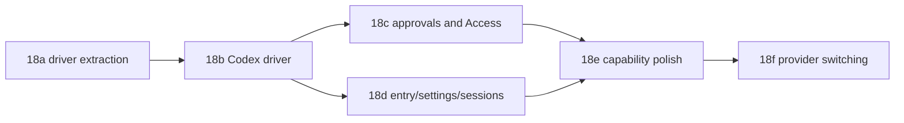

# Multi-provider agent pane (Codex backend) — TECH

Companion to [PRODUCT.md](PRODUCT.md). Product invariant references below use PRODUCT.md section numbers.

## Context

The pane already has the right normalized boundary, but the runtime path is still Claude-specific. `crates/claude_code/src/lib.rs:164` defines `TranscriptEvent` as the UI-facing stream contract and documents that raw Claude JSON must not escape the driver. `TranscriptEvent` already covers the surfaces this feature needs: session init, user/assistant text, thinking, tool calls/results, todos, permission/question requests, usage, task notifications, and ended states.

The current Claude runtime is concentrated in `crates/claude_code/src/driver.rs`: `PermissionMode` (`:27`), `SpawnOptions` (`:84`), `SpawnedSession` (`:112`), `spawn_session` (`:135`), `send_interrupt` (`:231`), `send_user_message` (`:301`), `send_control_response` (`:346`), the stdout/stderr stream pump (`:417`), the line parser (`:500`), and usage parsing (`:1245`). This is the extraction target for 18a.

Claude's local session store is isolated in `crates/claude_code/src/sessions.rs`: `StoredSession` (`:19`), cwd encoding and session paths (`:34`), session listing (`:81`), history replay (`:123`), and fork-by-truncating-jsonl (`:149`). Codex needs the same store shape from the pane's perspective, but it must not parse Codex's private rollout files unless the app-server API explicitly exposes stable session metadata.

The app pane still calls the Claude driver directly. `app/src/claude_code_view.rs:1049` constructs the pane from Claude `LaunchOptions`; `begin_session` builds Claude `SpawnOptions` and calls `spawn_session` (`:3227`); `on_session_spawned` owns the event drain and stdin writer (`:3285`); the stdin writer branches directly to `send_user_message`, `send_control_response`, and `send_interrupt` (`:3342`); `on_transcript_event` handles permission and ended events (`:3395`); permission changes are Claude `PermissionMode` values (`:3644`); fork calls `sessions::fork_session_file` (`:4661`); model/effort/permission controls are separate composer pills (`:6344`); and the approval card says "Claude wants to use..." with Allow/Deny only (`:8641`).

Feature 16 already provides the settings-facing provider seam. `app/src/app_state.rs:550` defines `CLIAgent::{Claude,Codex,Gemini,Unknown}`, `CLIAgentAdapter` starts at `:727`, and `adapter()` currently returns a real adapter only for Claude (`:686`). The Agent settings group in `app/src/settings/agent.rs:21` persists chat/action provider, model, effort, and permission defaults; `app/src/settings_view/agent_page.rs:50` renders the Agent page from those settings. 18 should extend this seam for Codex instead of inventing a second provider enum.

Persistence and entry points are Claude-named today. `crates/persistence/src/schema.rs:117` and `crates/persistence/src/model.rs:690` model `claude_code_panes` with only `session_id` and `cwd`; save/restore live in `app/src/persistence/sqlite.rs:1283` and `:2548`. Terminal interception is a hardcoded `claude` trigger in `app/src/terminal/input.rs:7350` with `CLAUDE_PROGRAM` at `:7355`, including alias expansion and conservative raw-CLI fallthrough. The left-panel session list is still `ClaudeSessions` (`app/src/workspace/view/left_panel.rs:2603`, `:2718`) and filters only Claude session presence.

Feature 19 has landed enough that 18 must not restyle the pane. `DesignShellV1` is enabled for dogfood and twarp-oss (`crates/twarp_features/src/lib.rs:831`, `app/src/bin/oss.rs:30`), and the left panel already has a design-shell branch (`left_panel.rs:2613`). 18 may add provider glyphs, labels, cards, and menu items required by PRODUCT.md, but visual layout and style sweeps stay owned by feature 19.

## Proposed changes

### 18a — driver extraction

Introduce a runtime `AgentDriver` abstraction in `crates/claude_code` without renaming the crate in this feature. The trait should cover spawn, send user turn, interrupt, answer pending request, parse provider output into `TranscriptEvent`, session-store access, and capabilities. `ClaudeDriver` should wrap today's `driver.rs` free functions and `sessions.rs` helpers with byte-for-byte behavior preservation.

Add typed provider-neutral request and decision types:

```rust
pub enum AgentProvider {
    Claude,
    Codex,
}

pub enum Decision {
    AllowOnce,
    AllowAlways,
    Deny,
    Answer(serde_json::Value),
}

pub struct DriverCapabilities {
    pub fork: bool,
    pub steering: bool,
    pub thinking: bool,
    pub cost: bool,
    pub usage_tokens: bool,
}
```

`Decision` replaces ad hoc serde payload construction in the view; `ClaudeDriver::answer` serializes it back to today's exact `control_response` JSON. Keep `SpawnedSession` and the event-stream plumbing as shared runtime types unless 18b proves Codex needs a different carrier.

Add `provider TEXT NOT NULL DEFAULT 'claude'` to `claude_code_panes` and to `ClaudeCodePaneSnapshot`. Absent or unknown provider metadata restores as Claude for PRODUCT §29. The table can keep its existing name for this feature to minimize migration blast radius; user-facing strings should move from "Claude sessions" toward "Agent sessions" where both providers appear.

Add golden-transcript tests before and after the extraction. Replaying recorded Claude stream-json through `ClaudeDriver::parse_line` must produce the same `TranscriptItem` sequence and stable snapshots as the pre-extraction path. This sub-phase should have zero user-visible behavior change and no Codex code path enabled.

### 18b — Codex driver

Add `CodexDriver` behind a new `CodexAgentBackend` feature flag in `crates/twarp_features`, **enabled for dogfood and twarp-oss builds** (exactly like `DesignShellV1` — lib.rs + oss.rs) so the fleet's UX-drive gate can actually exercise it; stable/preview keep it off. 18b must also ship the **minimal `codex` → agent-pane terminal trigger** (moved up from 18d — the UX gate's smoke path needs an entry point; a bare `codex` at an editable prompt opens the pane with provider=Codex when the flag is on, raw-CLI fallthrough otherwise). 18d retains alias expansion, flag-dialect parsing, settings light-up, auth flows, and the sessions sidebar.

**THE MODEL-SEEDING BUG — exact source (three UX rounds failed to locate it, do this first):** new panes seed model/effort from `AgentSettings::chat_launch_config()` through the precedence chain in `ClaudeCodeView::new` (launch flag → Chat row → fallback; historically `app/src/claude_code_view.rs:1032-1046`, find the `chat_launch_config()` call site). The Chat row is provider-tagged (`chat_provider`, feature 16): when the pane's provider differs from the row's provider, the row's `model`/`effort` MUST NOT seed the pane — a Codex pane seeded with the Claude row's "sonnet" sends an invalid model and the turn dies. Provider-mismatched rows contribute nothing; the pane falls back to the target provider's default model/effort (its adapter's `model_options()` default, or the provider's own config default when the list is empty). This is PRODUCT §24. Additionally: the user bubble concatenates the typed text with a second echo ("...summarlist the files..." artifact) — the composer's local echo and the message text are being double-inserted; dedupe to match the Claude driver's behavior.

**§8 RESTORE — exact wiring (two lineages failed here):** the restored Codex pane shows a blank zero-state and starts a NEW thread on send — the snapshot/restore path never engages resume. Fix all three legs: (a) on codex session init, the pane must WRITE its snapshot (provider + thread id in the session-id slot) exactly like Claude panes persist session_id — verify the save path actually fires for provider=codex; (b) the restore constructor must build `SpawnOptions` with `resume_session_id` = the persisted thread id (`CodexDriver::spawn` already honors it and issues thread/resume); (c) prior history must render on restore — use the app-server thread/resume response / thread/read items to rebuild the transcript, mirroring what `load_history` does for Claude. NOTE for the smoke: the "Missing environment variable: AZURE_FOUNDRY_API_KEY" error seen after relaunch is a gate-environment artifact (relaunching the binary from a shell loses the GUI session env that codex's Azure provider needs) — relaunch via LaunchServices (`open`/Dock/Spotlight), and do not chase that error in app code.

**Punch list from the exhausted 2026-07-16 rounds (fix these first — each was verified live by the UX gate; streaming/tool-calls/reasoning/Stop already worked in round 3):**

1. **Provider-specific empty-state/welcome copy.** The Codex pane repeatedly shipped the verbatim Claude welcome ("twarp drives the local `claude` CLI… Your existing Claude Code login is used"). Grep that exact string; the welcome/empty-state text, composer placeholder, and any login-hint copy must come from the provider (glyph, name, CLI name, auth wording). Four fix rounds missed this — find every call site, not the first one.
2. **§8 restore must resume the Codex thread.** After quit/relaunch the pane came back blank and the next send errored with `Missing environment variable: AZURE_FOUNDRY_API_KEY` — the restored pane's send path fell into the voice/suggestion (17d Azure STT) machinery instead of the Codex driver. The restore path must reconstruct the CodexDriver from the persisted provider+thread id and never touch voice/suggestion code; a missing voice key must never affect agent-pane sends.
3. **No duplicated user bubbles.** Round 3 observed every sent message rendering twice — likely both the local echo item and the app-server's userMessage item being appended; dedupe (render the local echo, skip the provider's echo, or vice versa — match what the Claude driver does).

Use `codex app-server` v2 over stdio, per STATUS.md. Vendor a minimal protocol subset under `crates/claude_code/src/codex/`, with `protocol.rs` containing hand-written serde structs for the request/notification/event shapes twarp consumes. Pin a minimum CLI version in one constant and check `codex --version` before spawning. On older or incompatible versions, emit a provider error/upgrade card instead of attempting best-effort parsing.

Process model for this feature: one app-server child per pane. Start with the app-server initialize handshake, then start or resume a Codex thread for the pane's cwd, model, effort, access policy, and sandbox. Persist the Codex thread id in the pane's current session id slot. Do not read or rewrite Codex's private local files for resume; rely on app-server thread start/resume/list APIs where available.

Map Codex app-server events into `TranscriptEvent` only:

| Codex concept | twarp event/model |
|---|---|
| thread/session start | `TranscriptEvent::SessionInit` |
| user message | `TranscriptEvent::UserMessage` |
| assistant text deltas/completion | `AssistantTextDelta` / `AssistantTextDone` |
| reasoning summaries | `ThinkingDelta` / `ThinkingDone` |
| command execution start/output/completion | `ToolCall` / live output item / `ToolResult` |
| file changes and diffs | edit tool card plus diff-card data |
| MCP/web/plan updates | existing MCP, web, and todo/plan transcript items |
| usage | `Usage` plus provider-shaped metrics without Claude cost |
| unknown item | generic expandable provider card |
| turn failure | `Ended { Error(provider_message) }` |

Track the current Codex `turnId` in a provider-neutral turn state and implement Stop with `turn/interrupt`; do not use SIGINT as the primary interrupt. Fixture tests should replay captured app-server JSONL into the driver without spawning Codex.

### 18c — approvals and Access

Replace the Claude-specific permission vocabulary in the pane with an `AccessStop` enum:

| Access stop | Claude native mode | Codex native mapping |
|---|---|---|
| Read-only | `plan` | read-only sandbox + on-request approval |
| Ask to edit | `default` | workspace-write sandbox + untrusted approval |
| Edits allowed | `acceptEdits` | workspace-write sandbox + on-request approval |
| Full access | `bypassPermissions` | danger-full-access sandbox + never approval |

Render the composer pill as Access for both providers. The popover should show the shared stop plus provider-native names so the mapping is inspectable. If a provider reports a native mode that does not map cleanly, show the native name rather than forcing it into one of the four stops.

Generalize the approval card from `TranscriptItem::Permission` into one component with provider name, verb-first title, detail block, and Allow once / Always allow / Deny. Claude can keep today's session semantics for "always" if it has no durable difference from "allow" in a given prompt type; Codex maps to its accept-for-session response. The `PendingRequest` registry must guarantee a response on every exit path: user action, Deny, pane close, provider process end, or superseded epoch. The safe default reply is Deny/decline.

Detect bypass flags in both launch dialects. `claude --dangerously-skip-permissions` and Codex bypass/sandbox flags set Access to Full access visibly before the first turn.

### 18d — entry, settings, auth, and sessions

Generalize the terminal trigger in `app/src/terminal/input.rs` from `CLAUDE_PROGRAM` to a command-to-`CLIAgent` table. Reuse the existing shell parser and alias expansion. Unsupported provider flags should fall through to the raw CLI path instead of being silently ignored.

Extend `LaunchOptions` or add a provider-neutral launch type so `claude` and `codex` flags parse into the same pane options: provider, prompt, model, effort, resume/thread id, access stop, cwd, and raw unsupported remainder. Keep Claude flag behavior regression-barred.

Implement a real `CLIAgentAdapter` for Codex in `app/src/app_state.rs`: executable name `codex`, install probe via PATH/login-shell PATH, login probe via a cheap side-effect-free CLI status command or app-server account probe, model/effort options from Codex when available with safe cached fallbacks, and capabilities enabled behind `CodexAgentBackend`. Gemini remains disabled.

Add Codex auth and version cards in the pane. Missing CLI shows install guidance. Logged-out CLI shows a Log in action that opens `codex login` in a terminal split and re-probes completion. Below-minimum CLI shows an upgrade card naming the minimum supported version. None of these states should leave the pane blank or spinning.

Provider-tag the past-session sidebar. Rows show Claude/Codex glyphs, a filter control supports All / Claude / Codex, and resume dispatches to the correct driver. If Codex app-server exposes discoverable local thread metadata for cwd, use that stable API; otherwise list only twarp-created Codex panes until a stable discovery surface exists.

### 18e — capability polish

Implement fork through driver capabilities. Claude keeps `sessions::fork_session_file`; Codex uses app-server `thread/fork` if the pinned protocol supports it. Hide the fork affordance when unsupported, rather than rendering a dead control.

Make the usage line provider-shaped. Claude keeps cost + tokens. Codex shows tokens and provider-reported quota/rate-limit information when present; it must not invent dollar cost. Provider errors should map known auth, context-window, usage-limit, protocol, and process-exit cases to readable ended states while preserving the provider's actionable message.

Put steering behind `DriverCapabilities::steering`. If Codex steering is available and reliable, wire it as a mid-turn provider capability; otherwise ship the capability false and leave the UI unchanged for both providers.

### 18f — in-pane provider switching

Add an idle-only provider section to the composer Model/Effort pill menu. The provider control is enabled only when no turn is running; during streaming it is disabled with no queued switch.

For a fresh pane with no completed turns, switching providers only swaps the pane provider and reseeds model/effort defaults from the target provider's Agent settings Chat row. Preserve composer draft text. Spawn lazily on the first send.

For mid-conversation switching, model it as a handoff, not shared provider state. Append a `TranscriptItem::ProviderSwitch { from, to, omitted }` divider, start a fresh target-provider session, and seed the first target turn with a digest built from existing `TranscriptItem`s. The digest should keep recent user/assistant turns verbatim within a budget, summarize commands and file edits, omit attachments/images, and explicitly disclose omissions in the divider details.

Persist mixed-provider panes as ordered segments. Add an additive `segments` JSON column to `claude_code_panes`, while keeping `provider/session_id` as the current segment for simple restore and back-compat. Restore stitches segment histories through each driver's session store and inserts divider items. A missing provider-side segment renders as a collapsed unavailable-history marker.

Access remaps by shared `AccessStop` on switch. Model and effort reset to the target provider defaults. Switching back to an earlier provider creates a new handoff session seeded with the full visible timeline; it must not silently resume the old provider session and drop intervening turns.

## Testing and validation

18a:

1. Golden Claude transcript replay: pre-refactor and post-refactor snapshots match item-for-item for PRODUCT §28.
2. Persistence migration test: old `claude_code_panes` rows without `provider` restore as Claude for PRODUCT §29.
3. Targeted unit tests for `Decision` serialization to today's Claude control JSON.
4. Manual smoke: PRODUCT 18a steps.

18b:

1. Codex fixture replay tests under `crates/claude_code` covering assistant streaming, reasoning, command output deltas, file changes, usage, unknown items, and turn failure for PRODUCT §5–§10.
2. Interrupt unit/fixture test proving `turn/interrupt` uses the tracked `turnId` for PRODUCT §7.
3. Spawn/version tests with mocked process launch for missing CLI, old CLI, failed initialize, and protocol mismatch for PRODUCT §20 and §34.
4. Manual smoke with `CodexAgentBackend` on: PRODUCT 18b steps.

18c:

1. Access mapping table tests for all four stops across Claude and Codex for PRODUCT §11–§12 and §16–§17.
2. Approval response tests for Allow once / Always allow / Deny across both providers for PRODUCT §13–§15.
3. Teardown test: pending Codex JSON-RPC approval receives decline when the pane closes or the epoch is superseded.
4. Manual smoke: PRODUCT 18c steps.

18d:

1. Trigger parser tests for bare `codex`, alias-expanded `codex`, supported flags, unsupported raw-CLI fallthrough, and unchanged `claude` behavior for PRODUCT §1–§4.
2. Settings tests proving Codex adapter enablement, model/effort population, auth state, and Chat-row seeding precedence for PRODUCT §18–§24.
3. Sidebar tests for provider-tagged rows, filter state, and provider-correct resume for PRODUCT §31–§32.
4. Manual smoke: PRODUCT 18d steps.

18e:

1. Fork tests mirroring the 07 fork turn-count cases for Codex where supported for PRODUCT §9.
2. Usage rendering tests: Claude cost remains, Codex token/quota line has no dollar cost for PRODUCT §21.
3. Error mapping tests for auth expired, context exceeded, usage limit, process exit, and malformed protocol for PRODUCT §22 and §33.
4. Manual smoke: PRODUCT 18e steps.

18f:

1. Fresh-pane switch test: draft preserved, no divider, target provider defaults applied for PRODUCT §36 and §39.
2. Mid-conversation digest tests over transcript items, including tool/edit summaries and omitted attachment disclosure for PRODUCT §37–§38.
3. Idle gating tests: provider switch disabled while streaming and re-enabled after Stop/Ended for PRODUCT §35.
4. Segment persistence/restore tests for mixed panes, missing segment history, and current-provider resume for PRODUCT §41 and §44.
5. Manual smoke: PRODUCT 18f steps.

Fleet-level validation: each implementation sub-phase should at minimum run `cargo build --bin warp-oss`, `cargo fmt -- --check`, targeted `cargo test -p claude_code` or app tests for touched modules, and `cargo clippy --workspace -- -D warnings` when the diff is ready. Real-display UX gates run on the primary Mac; this worker node stays headless.

## Parallelization

This feature is already split into fleet-sized sub-phases in `STATUS.md`; keep one sub-phase per branch and avoid parallel edits to the same checkout. The dependency order is mostly sequential:



18c and 18d can proceed in parallel after 18b if their branches own disjoint files: 18c owns driver request/decision types plus pane approval/access UI, while 18d owns terminal trigger, settings adapter, auth/version cards, and sidebar sessions. 18e should wait for both because it depends on capabilities, provider-shaped usage, and working Codex session lifecycle. 18f should land last because mixed-provider segments depend on the stable provider/session model.

Do not spawn local sub-agents from a fleet worker unless the dispatcher explicitly assigns that mode. The safer default is the fleet's branch-per-sub-phase model: `twarp-18-agent-providers-18a`, `twarp-18-agent-providers-18b`, and so on, all based on the latest `origin/master`, merged by the supervisor only.

## Risks and mitigations

1. Protocol drift: Codex app-server can change faster than twarp. Mitigate with a pinned minimum CLI version, vendored protocol structs, fixture schema snapshots, and an upgrade card instead of best-effort unknown behavior.
2. Claude regressions: 18a touches the driver seam used by every existing pane. Mitigate with golden transcripts, unchanged launch flags, and manual PRODUCT 18a smoke before Codex is enabled.
3. Approval wedges: Codex approvals are request/response and can block the turn. Mitigate with a central pending-request registry and decline-on-drop semantics.
4. Feature-19 churn: the pane has just been visually restyled. Mitigate by adding only required provider controls/cards and leaving layout, typography, spacing, and color sweeps alone.
5. Mixed-provider history fidelity: handoff digests are lossy by design. Mitigate by preserving the visible timeline, disclosing omissions in the divider, and never pretending the target provider resumed the source provider's native session.
