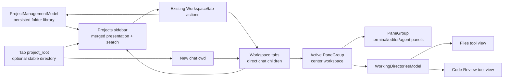

# Project sidebar and right tool rail — technical plan

## Context

This plan implements [`PRODUCT.md`](./PRODUCT.md) by combining the existing app-wide persisted project registry with each window's tab list. `ProjectManagementModel` and the existing `projects` table remain the source of truth for known folder-backed directories; one `TabData` is one direct chat child whose `PaneGroup` owns the working view tree. Tabs sharing `project_root` render under one project parent.

The current macOS design shell already renders full-height left and right rails around the workspace in `app/src/workspace/view.rs:20497-20595`, but it still renders the horizontal tab bar inside the center column. The left rail is implemented by `LeftPanelView` and owns Files/search/Timeline (`app/src/workspace/view/left_panel.rs:407-435`, `2688-2765`); the right rail is implemented by `RightPanelView` and owns Code Review (`app/src/workspace/view/right_panel.rs:417-430`, `2041-2092`). The project-sidebar shell must change the ownership of those surfaces rather than stack another navigation layer on top.

The principal existing state and behavior to preserve are:

- `TabData` owns the `PaneGroup`, tab interaction state, selected/default color, and detached state (`app/src/tab.rs:195-232`). It is the correct place for tab-scoped project identity.
- `Workspace::activate_tab` and `set_active_tab_index` already switch the live pane group and retarget Files, Code Review, and git state (`app/src/workspace/view.rs:4181-4197`, `4254-4317`). Project selection must call this path rather than reimplement it.
- `WorkingDirectoriesModel` already holds per-pane-group roots plus project-specific file tree, search, repository selection, and Code Review views (`app/src/pane_group/working_directories.rs:60-113`, `148-190`). These roots are derived from live panes, so they are useful context but are not by themselves a stable assigned project directory.
- `CrossWindowTabDrag` and `Workspace::on_tab_drag` already reorder or transfer a complete pane-group view tree (`app/src/workspace/cross_window_tab_drag.rs`, `app/src/workspace/view.rs:10921-11107`). The sidebar should supply a vertical drop surface to this machinery.
- Claude/Codex chat panes already expose working directory, provider, session ID, title, and attention status (`app/src/claude_code_view.rs:1541-1563`, `4282-4335`). `PaneGroup` can already focus a pane by ID and enumerate Claude Code working directories (`app/src/pane_group/mod.rs:4637-4649`, `6087-6095`).
- Window/tab restoration is represented by `WindowSnapshot` and `TabSnapshot` (`app/src/app_state.rs:1044-1080`) and stored in the SQLite `windows` and `tabs` tables (`crates/persistence/src/schema.rs:385-391`, `465-490`; `app/src/persistence/sqlite.rs:857-875`, `2637-2773`). New shell state must round-trip through this path while retaining legacy fields.
- `ProjectManagementModel` is already an app singleton backed by the SQLite `projects` table and emits `ProjectEvent` when a folder is registered (`app/src/projects.rs`, `app/src/persistence/sqlite.rs:1500-1529`). Command search already consumes this model as a recent-project library. The sidebar should reuse it rather than create another persistence layer.
- `design_shell_v1_enabled()` is macOS-only and currently suppresses legacy vertical tabs (`app/src/workspace/view.rs:632-655`). The new shell needs a separate flag layered on top of Design Shell v1 so the existing layout remains a safe fallback.
- `design/PHILOSOPHY.md:69-75` currently mandates a horizontal tab strip and identifies the left sidebar as Tools. The PRODUCT spec explicitly supersedes those rules, so implementation must update the checked-in shell rules in the same change.

### Architectural decisions

1. **Project library and live chats are separate layers.** `ProjectManagementModel` owns unique persisted folder identities, while `Workspace.tabs` owns ordered live chats and scratch tabs. Sidebar parents come from the folder layer; direct children come from tabs.
2. **Project identity is keyed by pane-group `EntityId` at runtime.** UI callbacks resolve the current tab index at dispatch time so reorder, close, and cross-window moves cannot leave stale index captures.
3. **An assigned project root is stable and optional.** It is stored on the tab, moves with the tab, and does not change when a pane or chat changes directory. Derived working directories remain available for legacy and multi-folder projects.
4. **Chat children are tabs, not panes.** A tab remains one chat row even when its `PaneGroup` contains multiple panels. Closing/restoring a tab removes/restores that direct child row.
5. **Shell visibility is window-owned.** Project sidebar visibility/width and active right tool are not properties of the active project. Files and Code Review content remain project-owned through `WorkingDirectoriesModel`.
6. **The horizontal and project-sidebar shells coexist behind flags.** The new code path does not reinterpret the legacy vertical-tabs setting or delete legacy panel data.
7. **Opening is local; discovery is global.** Selecting an unopened library entry creates a normal tab in the current workspace. Existing tabs in other windows are not transferred, cloned, or mutated.

### Data flow



### 2026-07-24 implementation refinement (authoritative)

This refinement supersedes any older detail later in this plan that describes one tab as one project, pane-level chat nesting, project-only search, embedded Files search, or diff totals on the activity icon.

- `ProjectListTarget::LiveProject(Vec<usize>)` groups real tab indices by exact optional `TabData::project_root`; `Library(PathBuf)` represents a registered directory with no local tab. Settings pane groups are filtered before merging and therefore never become project/chat rows.
- The hierarchy is exactly Project → Chat. A chat is an existing workspace tab. Its title, status, context menu, drag state, colors, persistence, and live pane tree continue through existing tab machinery. There is no expanded-chat set in the presentation and no pane enumeration for sidebar nesting.
- `New chat` constructs a `ClaudeCodePane` with the resolved project cwd, wraps it in a new `PaneGroup`/`TabData`, inserts it after the project's last tab, assigns the target `project_root`, inherits project colors, activates it, refreshes working directories, and saves app state.
- `AddDefaultTab` snapshots the active folder-backed project's root and selected/default colors before running the existing new-tab content path. If that path activates a distinct tab, the new `TabData` receives the snapshot so Cmd+T groups it beneath the existing project. Settings, legacy-shell, rootless, and failed/no-op creation paths do not inherit a folder project.
- A pane-header drag accepts `ProjectSidebarPaneDropTargetData { project_root, tab_insert_index }`. Only a source tab with more than one visible pane may preview the promotion. Drop removes the hidden source pane, creates a new tab at the project insertion point, assigns the target root/colors, and leaves the source tab's remaining panes intact. Invalid/cancelled drops clear the hidden-move preview.
- `Workspace.projects_sidebar_open`, `right_tool`, and `right_tool_open` remain the persisted canonical shell state. `PanelSlide`/`SlideClip` animate explicit left/right edge toggles from the current fraction. The Projects toggle is always a traffic-light-adjacent overlay. Switching right tools swaps content without an edge animation; Cmd+Shift+`+` toggles the remembered `right_tool`.
- The Projects search icon dispatches the Cmd+P command palette action. Cmd+Shift+F activates a dedicated Search right tool backed by the active pane group's existing `GlobalSearchView`; Files contains no search overlay.
- The right activity strip renders icon-only Files, Search, and Code Review controls. Agent `RepoContext` supplies changed-file/addition/deletion totals to the agent header's `Changes` row, including staged changes and untracked-file counts.
- `RightToolKind::Search` persists as value `2`. Search reuses `LeftPanelView` and the Files utility width, but switches its active `ToolPanelView` to `GlobalSearch`; this avoids a second search model while keeping Files and Search as mutually exclusive shell destinations.
- `LeftPanelView` tracks whether the project shell is actively presenting Files; file-tree subscriptions use that state instead of the legacy `PaneGroup::left_panel_open` flag. This keeps folder expansion populated after Files moves to the right rail without leaving hidden trees active.
- A plain Code Review file-row click dispatches `ToggleFileExpanded` after updating selection. Shift/Cmd/Ctrl clicks remain selection-only, and the explicit diff action continues to dispatch `OpenFileDiffInNewTab`.

## Proposed changes

### 1. Add a guarded project-sidebar shell

Add `FeatureFlag::ProjectSidebar` using the repository's feature-flag workflow. Define one helper in `app/src/workspace/view.rs`:

```rust
fn project_sidebar_enabled() -> bool {
    cfg!(target_os = "macos")
        && FeatureFlag::DesignShellV1.is_enabled()
        && FeatureFlag::ProjectSidebar.is_enabled()
}
```

Do not overload `VerticalTabs`, `TabSettings::use_vertical_tabs`, or toolbar-position settings. When the flag is false, every current render, action, and persistence path remains active. The flag should initially be disabled outside local/dogfood builds; enable it by default for `twarp-oss` only after the migration and manual UX gates pass.

Update `design/PHILOSOPHY.md` in the implementation PR so the shell rules describe Projects on the left, no global horizontal tab strip under this flag, and the Files/Code Review activity strip on the right. Keep the source-list anatomy, traffic-light clearance, `outline()` seams, semantic colors, and window-drag rules.

### 2. Extend tab identity with an assigned project directory

Add these fields to `TabData`, `TabSnapshot`, `TransferredTab`, and the persistence model:

```rust
pub project_root: Option<PathBuf>,
pub project_root_initialized: bool,
```

`project_root_initialized` distinguishes a newly created rootless project from an old database row whose new root column has not been migrated. In SQLite, add nullable `project_root` binary and `project_root_initialized` boolean columns to `tabs`. Encode the path with the existing platform-safe `encode_path`/`decode_path` helpers in `app/src/persistence/sqlite.rs:1327-1367` rather than lossy UTF-8 conversion.

Initialization rules:

- `Start from scratch`: `project_root = None`, `project_root_initialized = true`.
- `Use an existing folder`: canonicalized selected folder, `project_root_initialized = true`.
- Existing row with `project_root_initialized IS NULL`: after pane restore and the first working-directory refresh, promote exactly one unambiguous root to `project_root`; leave `project_root = None` for zero or multiple roots; then mark initialized. This is a one-time compatibility migration, not an ongoing observer of pane cwd.
- Cross-window transfer carries both fields with the pane group.
- Changing a chat, terminal, or pane cwd never changes `project_root`.

Add one project-directory resolver used by titles and `New chat`:

```rust
enum ProjectDirectoryResolution {
    Resolved(PathBuf),
    ChooseFrom(Vec<PathBuf>),
    Unavailable,
}
```

Resolution first uses the assigned root if it still exists and is readable, then considers the current deduplicated roots from `WorkingDirectoriesModel`. One derived root resolves directly; multiple roots require a choice; no roots are unavailable. An invalid assigned root produces the retryable error required by the product rather than silently choosing another directory.

### 3. Add window-owned shell state and independent width handles

Keep the canonical state on `Workspace`, not in the active `PaneGroup`:

```rust
#[derive(Clone, Copy, Debug, Eq, PartialEq)]
enum RightTool {
    Files,
    Search,
    CodeReview,
}

struct ProjectSidebarState {
    open: bool,
    expanded_projects: HashSet<EntityId>,
    focused_project: Option<EntityId>,
    search_query: String,
    search_open: bool,
    scroll_state: ScrollState,
}

struct RightToolHostState {
    active_tool: Option<RightTool>,
    preferred_tool: RightTool,
    responsive_collapsed: bool,
}
```

The open state is `active_tool.is_some()`. `preferred_tool` preserves which tool should return after an explicit close or a responsive collapse. `responsive_collapsed` is derived from available layout width and must never be persisted as the user's preference.

Project expansion, focus, and scroll are runtime view state. The PRODUCT spec does not require expansion to survive relaunch. Search query is cleared whenever search closes and whenever the Projects sidebar is reopened, while the pre-search scroll position is restored.

Extend `ResizableData` with separate modal types/handles:

- `ProjectsSidebarWidth`
- `FilesToolWidth`
- `CodeReviewToolWidth`

Retain `LeftPanelWidth` and `RightPanelWidth` for the legacy shell. Each new handle uses the existing min/max constraints and resize implementation, but Files and Code Review no longer share a width.

### 4. Merge the global project library with live window tabs

Keep `app/src/workspace/view/project_sidebar.rs` as the sidebar-specific `impl Workspace`, but build its row targets from both `ProjectManagementModel::all_projects()` and `Workspace.tabs`. Rendering within `Workspace` still gives live rows direct access to tab mouse, rename, draggable, color, and menu state; library rows remain lightweight path targets.

Add a cloneable target type used consistently by rendering and keyboard search:

```rust
enum ProjectListTarget {
    LiveTab(usize),
    Library(PathBuf),
}
```

Build live rows first in tab order. Collect their assigned canonical roots into a set, then append registry entries whose paths are not represented by a local tab, sorted by descending `last_used_at` and stable path tie-breaker. Multiple local tabs with the same root remain multiple live rows; there is never an additional unopened row for that same root.

Library rows use the directory basename and parent-path context, derive their dot from the existing `DirectoryTabColors` setting, and have no tab-only menu, rename, status, drag, or chat children. Their click target dispatches a path-based workspace action. Both row kinds share the same source-list anatomy and search field.

Subscribe every `Workspace` to `ProjectManagementModel`. An add/update event only calls `ctx.notify()`; it does not change local active selection, focus, or scroll state. This makes a project registered in one window appear in all others immediately.

Build a pure view model on each render:

```rust
struct ProjectRowData {
    pane_group_id: EntityId,
    title: String,
    disambiguation: Option<String>,
    full_context: String,
    color: Option<AnsiColorIdentifier>,
    attention: Option<ProjectAttention>,
    active: bool,
    chats: Vec<ProjectChatRowData>,
}

struct ProjectChatRowData {
    pane_id: PaneId,
    session_id: String,
    title: String,
    status: Option<ConversationStatus>,
    active: bool,
}
```

Title selection follows PRODUCT invariant 24 exactly: custom title, assigned/single unambiguous folder basename, existing `PaneGroup::display_title`, then `Untitled project`. Run a second pass over normalized visible titles to add the shortest unique parent-folder, branch, or ordinal disambiguator only to collisions. Search uses normalized case-insensitive text assembled from custom/display title, all current roots and repositories, branch metadata, and active pane title for live rows, and folder name plus full path for library rows. It filters the merged target list without activating or reordering tabs. Up/Down/Enter use that same target list so keyboard focus cannot diverge from rendering.

The sidebar has four fixed/rendered regions:

1. traffic-light/drag reservation, collapsed in fullscreen;
2. `PROJECTS` header with search, create, and close controls;
3. independently scrolling project list;
4. Settings footer with conditional update/offline indicators.

Rows use source-list anatomy from `design/PHILOSOPHY.md`: theme tokens, `surface_1`, `surface_overlay_2` hover, `surface_3` selection, one inner `outline()` hairline, no row borders, and shared naked/action-button themes. The header owns a window-drag region only where there is no interactive child. There is no logo or permanent placeholder child text.

If the last tab closes but the window remains alive, retain all registry rows and render the existing welcome surface in the center. Render `No projects yet` only when both the registry and live tabs are empty. Preserve the platform's existing close-last-tab policy.

### 5. Route project interactions through existing tab behavior

Add project-specific actions whose payload is a pane-group ID rather than a tab index. At execution, resolve the current index from `Workspace.tabs` and invoke the established action:

- project click → `activate_tab`;
- unopened library click → validate the path, activate an already-open local tab if one appeared concurrently, otherwise call the existing folder-project constructor;
- rename/double-click → existing tab rename editor and commit/cancel path;
- more menu → `TabData::menu_items` with the resolved index;
- close/middle-click/shortcuts → existing close actions and nearest-tab fallback;
- next/previous/direct/recent selection → unchanged tab commands;
- context menu, color, save/share/copy metadata → existing tab actions.

This keeps project selection a presentation change. A child action must stop propagation so new-chat/menu/close never activates the row accidentally.

The path-based open action reuses `create_folder_project`, including canonicalization, readability checks, the existing unavailable-folder toast, project-model upsert, welcome/terminal construction, assigned-root setup, and app-state save. It never uses cross-window tab transfer: an open instance in another window is intentionally independent.

For drag and drop, generalize the current layout boolean in `CrossWindowTabDrag` into a presentation enum such as `HorizontalTabs`, `LegacyVerticalTabs`, and `ProjectSidebar`. Register the Projects list rectangle and each row's `tab_position_id(index)` as vertical drop targets. Reuse the existing reorder/detach/insert state machine and `TransferredTab`; only the hit-testing axis, insertion marker, preview, and edge auto-scroll differ. Invalid/cancelled drops leave the source collection untouched.

### 6. Create projects through one transactional path

Introduce a single constructor-level operation rather than separately composing tab creation, folder setup, and activation in UI callbacks:

```rust
enum NewProjectSource {
    Scratch,
    ExistingFolder(PathBuf),
}

fn create_project(source: NewProjectSource, ctx: &mut ViewContext<Workspace>);
```

`Scratch` creates the same untitled tab/pane-group and welcome/new-session surface used by ordinary new-tab creation, but records an initialized rootless project and does not register it globally. `ExistingFolder` performs validation before modifying `Workspace.tabs`:

1. open `FilePickerConfiguration::folders_only()` as `open_repository` does today (`app/src/workspace/view.rs:10842-10874`);
2. on selection, canonicalize off the render path and verify directory/readability;
3. only after success upsert the canonical directory in `ProjectManagementModel`, create the tab/pane group, assign `project_root`, register the directory with working-directories state, and activate it;
4. initialize the welcome/new-session surface with that root as its context instead of immediately opening an unrelated terminal;
5. on cancellation or failure, do not append a tab or disturb focus/order/scroll.

The folder basename is context, not a forced custom tab title. This lets user rename/reset continue to follow existing semantics while the title resolver naturally displays the basename. Selecting an already-used folder through the create menu intentionally creates another independent tab-backed project. Selecting the library row itself activates an existing local instance when present and creates at most one new local instance per action.

Keep browser, terminal, worktree, and other pane-level creation in their existing command/menu homes. The horizontal strip may be removed only after an audit confirms every former top-strip action has another visible, palette, menu, or keybinding home.

### 7. Add project-scoped chat enumeration and creation

Add a narrow public accessor on `PaneGroup`:

```rust
pub struct ProjectChatItem {
    pub pane_id: PaneId,
    pub session_id: String,
    pub title: String,
    pub status: Option<ConversationStatus>,
}

pub fn project_chat_items(&self, ctx: &AppContext) -> Vec<ProjectChatItem>;
```

It enumerates live `ClaudeCodePane` instances only and derives title/status through their current view APIs. It does not expose the private pane collection and does not query `StoredSession` history. Existing pane snapshots already persist a chat's session ID and cwd, so restored chat panes automatically return as child rows.

Implement `New chat` as a workspace operation keyed by project/pane-group ID:

1. resolve the project at dispatch time and activate it;
2. resolve its directory using `ProjectDirectoryResolution`;
3. for multiple roots, show a compact picker and create nothing on cancel;
4. read the authoritative provider/model/effort/permission values from `AgentSettings::chat_launch_config()` (`app/src/settings/agent.rs:351-366`);
5. create a fresh `ClaudeCodePane` with the resolved cwd and add/focus it inside the existing project `PaneGroup`;
6. never call `open_claude_code_tab`, never replace an existing chat, and never reuse an existing session ID;
7. focus the empty composer after the pane is mounted.

Use the existing pane insertion API with `focus = true`; if the only pane is the disposable welcome placeholder, it may be replaced through a dedicated helper, otherwise add a split so live content is preserved. The initial composer reads its cwd from `ClaudeCodeView::cwd`, which supplies the visible directory context and command/file resolution.

Clicking a chat child first activates the owning project and then calls `PaneGroup::focus_pane_by_id`. The pane itself remains the single owner of transcript, provider, cwd, title, scroll, and streaming state. A chat whose cwd later changes remains a child of the same project and does not change the assigned project root.

### 8. Replace the horizontal strip with a true three/four-region shell

Refactor `render_tab_bar_and_panels_column` into reusable center rendering plus shell chrome:

- `render_workspace_panels_column(...)` renders pane content and pane-specific headers only;
- the legacy branch wraps it with the existing horizontal tab strip;
- the project-sidebar branch never constructs the tab strip, so no hidden or zero-opacity row retains height or hit targets.

The project-sidebar render branch in `Workspace::render` builds, left to right:

1. optional Projects sidebar (including its slide clip);
2. shrinkable center workspace;
3. optional active right-tool content rail (including slide clip);
4. always-visible activity strip, except when existing zen/distraction-free chrome rules hide it.

The Projects and tool rails are edge-to-edge and use one hairline at each inner seam. The center receives no replacement top padding for the removed tab strip. Pane-local headers remain part of pane rendering.

When Projects is closed, render its compact reopen control in the traffic-light-adjacent overlay that the current shell already uses for left-panel recovery. Reopening restores the saved Projects width, list scroll, and focused row; the overlay must not reserve a full center toolbar row.

Keep the current approximately 150ms self-rearming slide animation for explicit open/close. Switching Files ↔ Search ↔ Code Review swaps the child in the already-open rail without an edge slide. Reversing a transition starts from the current visible fraction. Clip and disable pointer hit-testing outside the visible fraction.

Add a pure layout policy that receives window width, saved rail widths, activity-strip width, and minimum center width. When the layout would violate the center minimum, set `responsive_collapsed = true`; clear it when enough width returns. Do not modify `active_tool` or persisted widths during this temporary collapse.

### 9. Introduce the right activity strip and tool host

Create `app/src/workspace/view/right_tool_host.rs` for `RightTool`, toggle/reducer helpers, activity-strip rendering, and layout policy. The state transition is deterministic:

- click inactive tool → set it active and open;
- click another tool → switch directly, keep rail open;
- click active tool → set rail closed and remember it as preferred;
- click active Code Review while maximized → exit maximize and close its content, leaving the activity strip available;
- switch away from maximized Code Review → clear maximize before showing Files or Search;
- responsive collapse → hide content only, preserving the active/preferred tool.

The strip renders Files, Search, then Code Review in a stable order with shared icon-button styling, tooltips, accessible labels, keyboard focus, and an active indicator beyond color. Diff totals render in the agent Environment menu, not on the strip.

Move Files/Search/Timeline content out of left-shell ownership. The implementation reuses `LeftPanelView` as the utility-rail content host while making Files and Search distinct `ToolPanelView` destinations. Under the project-sidebar flag it:

- binds to `FilesToolWidth`;
- renders a left seam and left resize handle because it is now on the right;
- renders only file tree and Timeline for Files;
- renders the project-keyed `GlobalSearchView` for Search, sharing the Files utility-width handle but not its content surface;
- keeps tree indentation/disclosures unchanged.

Keep `RightPanelView` as the Code Review content implementation initially, binding it to `CodeReviewToolWidth` under the new shell. Hide its redundant close button only under `ProjectSidebar`; the activity icon becomes the close target. Preserve repository selection, staged/unstaged operations, commit/diff flows, loading/unsupported states, and project retargeting (`app/src/workspace/view/right_panel.rs:605-665`).

When the active project changes, `set_active_tab_index` retargets both tool views even if one is hidden. The selected tool and window widths do not change. Loading or unsupported content therefore belongs to the new project and cannot flash the previous project's content.

Route existing commands as follows under the feature flag:

- `ToggleProjectExplorer` → toggle `RightTool::Files`;
- global/project file search → toggle or activate `RightTool::Search` and focus its query field;
- Code Review toggle/events → toggle `RightTool::CodeReview`;
- maximize Code Review → occupy the center-plus-tool content area while leaving Projects and the activity strip rendered;
- Files selected while Code Review is maximized → exit maximize and open Files at its saved width.

Legacy action behavior remains unchanged when the flag is off.

### 10. Persist new shell state without losing fallback data

Add nullable fields to the `windows` persistence row and corresponding model/snapshot types:

```text
projects_sidebar_open
projects_sidebar_width
right_tool_kind
right_tool_open
files_tool_width
code_review_tool_width
```

Store `right_tool_kind` as a validated small integer/string enum; unknown values fall back safely rather than panicking. Keep the new values in `WindowSnapshot` even when the feature is disabled so loading and saving in a fallback build does not erase them.

Migration from a row with all new fields null:

- Projects defaults open.
- Projects width falls back to the legacy left-panel width.
- Files width falls back to the legacy left-panel width.
- Code Review width falls back to the legacy right-panel width.
- If legacy Code Review was open, select Code Review; otherwise, if legacy Files was open, select Files; otherwise keep the right rail closed with Files preferred.

Preserve all legacy `left_panel_open`, `right_panel_open`, vertical-tabs, and panel-width data in snapshots. While the project-sidebar shell is active, do not rewrite those fields from the new mutually exclusive tool host; round-trip their last legacy values unchanged. While the legacy shell is active, likewise round-trip the new fields unchanged. New tabs created under the project shell receive safe closed defaults for their legacy per-tab panel fields.

Save and restore order:

1. load both legacy and new snapshot fields;
2. choose a shell only after feature/platform evaluation, before first render;
3. construct tabs and assigned project roots;
4. restore active tab/project by existing identity/index rules;
5. restore Projects visibility/width and right-tool preference/widths;
6. render only the selected shell—never briefly mount the horizontal strip;
7. complete one-time root inference after working-directory refresh and persist it at the next normal state save.

### 11. Accessibility, focus, and keyboard handling

Add a Projects focus scope and roving row focus independent of active selection. In the list, Up/Down move focus, Enter/Space activate, context-menu key opens the tab menu, and Escape returns focus to the active pane. Search owns Up/Down/Enter/Escape while open and never activates a project merely by filtering.

Accessible project labels include full title, collision context, selected state, and the single highest-priority attention state. Chat labels include full chat title and status. Tool icons expose name, active/expanded state, and badge text. Color is supplementary in every case.

Use existing focus handles for rename editors and the new-chat composer. Closing/reordering a focused row moves focus deterministically to the same project that becomes active. The sidebar toggle returns focus to the previously focused project when reopened.

### 12. Delivery sequence

Implement behind the disabled feature flag in these checkpoints:

1. **Model and compatibility:** feature flag, project-root fields, new snapshots/schema migration, shell/right-tool reducers, separate resize handles, unit tests.
2. **Projects presentation:** sidebar layout, row data/title/search, activation/actions, empty state, horizontal-strip-free center path, accessibility.
3. **Project workflows:** create menu, transactional folder creation, chat enumeration/creation/focus, directory error states.
4. **Right tool host:** activity strip, Files extraction/right placement, Code Review adaptation, command routing, maximize and responsive behavior.
5. **Manipulation and polish:** vertical/cross-window drag, animation reversal, fullscreen/traffic lights, design-token audit, philosophy update.
6. **Rollout:** persistence migration tests, integration/manual matrix, light/dark evidence, dogfood enablement, then `twarp-oss` default after UX approval.

Each checkpoint must leave the flag-off shell buildable and behaviorally unchanged. Do not remove legacy settings or schema fields in this feature.

## Testing and validation

### Unit tests

Add pure tests beside the new modules for:

- title priority, collision disambiguation, multi-folder description, truncation source text, and attention precedence (PRODUCT 20–30);
- case-insensitive project search across every indexed field, stable ordering, active-project filtering behavior, and query clear/scroll restoration (57–63);
- right-tool toggle transitions, direct switching, preferred-tool preservation, independent widths, maximize exit, and responsive collapse/return (64–75, 85–87, 96–101);
- project-directory resolution for assigned, one-root, multi-root, invalid, and unavailable cases (43–56);
- runtime ID-to-current-index resolution after reorder/close and vertical insertion-index calculation (34–40);
- pure shell layout proving no tab-strip height is reserved and the right rail collapses before the center crosses its minimum (1–10).

Extend pane-group tests for `project_chat_items` to prove that only live chat panes appear, titles/statuses update, and a closed chat disappears (53–55).

### Persistence tests

Extend `app/src/persistence/sqlite_tests.rs` with round trips for:

- arbitrary Unix path bytes in `project_root`, including non-UTF-8 paths where supported;
- initialized rootless, explicitly rooted, and legacy-null tab states;
- one-time single-root inference and no inference for multi-root tabs;
- project order, selected tab, custom title, color, and assigned root across save/restore;
- Projects open/width, active right tool/open state, and independent Files/Code Review widths;
- null-column migration fallbacks from legacy left/right panel states;
- flag-on save followed by flag-off load/save followed by flag-on load, proving neither state family is erased (95–102).
- project-registry entries surviving after their last live tab closes and appearing after constructing a fresh workspace (103–108).

### Workspace and view tests

Add focused workspace tests for:

- project click activates the existing pane tree without recreation (20–23, 34);
- close fallback selects following then previous project and keeps shell tool state (38–40);
- rename, menu, color, shortcut, and drag actions continue to address the correct tab after reorder (28, 31–37, 40);
- existing-folder creation commits only after validation; cancel/error leaves tabs, focus, order, and scroll unchanged (43–48);
- `New chat` activates the target project, creates a distinct pane with the correct cwd and configured provider, and never replaces an existing chat (49–52, 56);
- child click activates and focuses the existing pane/session (53–55);
- active-project changes retarget Files and Code Review while retaining selected tool and width (67–75, 82–87).
- merged target construction deduplicates unopened roots against local tabs, preserves duplicate local tabs, and keeps scratch tabs local (20–23, 103–108);
- selecting a library row opens it only in the current workspace, while a project-model event rerenders every subscribed workspace without changing selection (103–108).

### Integration coverage

Add a project-sidebar integration scenario under `crates/integration` and register it with the manual/integration runner. Enable both `DesignShellV1` and `ProjectSidebar`. Expose a test-only path-based project action so the test does not automate the native folder picker.

The scenario should:

1. create two folder-backed projects, including the same folder twice, and verify independent local rows;
2. start two chats in one project and assert both inherited cwd values;
3. switch projects and child chats and verify pane/session identity is unchanged;
4. open Files, switch to Code Review, return to Files, and assert project retargeting plus independent widths;
5. reorder, detach/reattach when the harness supports multiple windows, close, save, and restore;
6. verify no horizontal tab-strip element exists while the flag is enabled;
7. disable the flag and run an existing horizontal-shell smoke test.
8. create a second window, verify it shows the registered folders without receiving the first window's tabs, open one library row there, and verify both windows retain independent live instances.

Retain existing Files/global-search, Code Review, tab restore, and cross-window drag suites as regressions.

### Manual and UX validation

Validate the complete PRODUCT invariant set on macOS:

| PRODUCT invariants | Manual validation |
| --- | --- |
| 1–11 | Windowed/fullscreen/narrow layouts; zero tab-strip gap; rail resize and responsive collapse; traffic-light and drag regions. |
| 12–19 | Header/list/footer anatomy; no logo; fixed header/footer; Settings/update/offline behavior; action-home audit. |
| 20–42 | Empty, single, many, duplicate-name, multi-root, colored, running, blocked, reordered, detached, renamed, closed, and keyboard-navigated projects. |
| 43–56 | Scratch/folder creation, picker cancel, unreadable/missing folder, duplicate folder, new chat cwd, multiple chats, multi-root picker and cancel/error. |
| 57–63 | Every search field, no matches, active row filtered out, keyboard acceptance/cancel, scroll restoration. |
| 64–81 | Tool icon mouse/keyboard states, direct switching, separate widths, Files tree/search/Timeline, project switches and loading/unsupported states. |
| 82–87 | Full Code Review workflow, diff badge, header without duplicate close, maximize/minimize and switching to Files. |
| 88–94 | Global chrome duplicate/action audit and hidden legacy layout settings under the feature. |
| 95–108 | Relaunch, flag rollback/forward, animations, rapid reversal, theme/zoom/resize/fullscreen, fallback platforms, global library visibility, live cross-window updates, independent per-window instances, and unavailable stored paths. |

Run the visual pass in light and dark themes at default and non-default zoom, with short/long/localized titles, reduced window widths, and VoiceOver. Attach screenshots or video for Projects open/closed, Files, Code Review, maximized Code Review, search, empty state, folder error, duplicate names, and narrow responsive collapse.

### Required commands

Run targeted tests first, then the repository checks:

```text
cargo test -p twarp project_sidebar
cargo test -p twarp project_root
cargo test -p twarp right_tool_host
cargo fmt -- --check
cargo build --bin twarp-oss
cargo clippy --workspace -- -D warnings
```

If the full clippy/test suite has a baseline or environment failure, report it separately and retain successful targeted evidence for the changed modules.

## Risks and mitigations

### Two shell state models drift

The existing `PaneGroup` panel booleans are project-scoped, while the new rail state is window-scoped. Sharing them would reintroduce tool changes on project switch.

Mitigation: keep new state solely on `Workspace`, route actions at the feature boundary, and round-trip legacy state without using it as canonical state under the new shell. Add flag-on/off persistence tests.

### Project roots accidentally follow pane cwd

`WorkingDirectoriesModel` intentionally changes as panes change and canonicalizes paths during refresh. Treating its first root as the permanent project root would silently reassign projects.

Mitigation: persist an explicit optional `project_root`, perform only a one-time legacy inference, and use a resolver that does not mutate the assignment. Keep canonicalization/validation off the render path.

### Global library and live tabs are confused

Treating registry entries as tabs would imply pane state, menus, drag, and chat children that do not exist; treating tabs as the registry would make projects disappear from new windows.

Mitigation: use an explicit `ProjectListTarget` and exhaustive handling. Only `LiveTab` targets receive tab behavior; only `Library` targets use path-based open. Pure merged-list tests cover deduplication and scratch projects.

### Chat rows become another session database

Using global stored-session history would show chats that are not part of the tab and create ambiguous ownership.

Mitigation: enumerate only live `ClaudeCodePane`s in the project's existing `PaneGroup`; let existing pane snapshots provide restore.

### Right-tool refactor regresses legacy Files or Code Review

Files currently assumes a left resize edge and Code Review owns its own close/maximize behavior.

Mitigation: isolate placement-specific chrome from tool content, retain a legacy adapter, feature-gate close/resize differences, and run existing tool suites in both shell modes.

### Removing the tab strip removes hidden action homes

The current strip owns more than tab labels, including create/global controls and traffic-light padding.

Mitigation: split center content from strip chrome only after an action inventory. Each removed control must have a tested header/footer/menu/palette/keybinding replacement, and traffic-light/window-drag tests cover the new owner.

### Cross-window drag carries incomplete identity

The current transfer payload carries pane group and tab presentation but not a project root.

Mitigation: extend `TransferredTab` before enabling project-row drag and test reorder, cancel, detach, insert, and save/restore with an assigned root.

### Narrow windows oscillate around the collapse threshold

Immediate collapse/restore at one width can flicker during resize.

Mitigation: give the pure layout policy a small token-derived hysteresis margin: collapse at the minimum-center threshold and restore only after the margin is available. Never persist responsive collapse.

## Explicitly deferred

- Pinning, manual ordering, or grouping of the persistent project library; unopened entries remain most-recently-used.
- Grouping multiple tabs by repository.
- Non-chat child rows or global chat-history children.
- Windows/Linux/WASM project-sidebar rollout.
- Removal of legacy tab/panel settings or persistence fields.
- A general customizable activity-bar framework beyond Files and Code Review.
